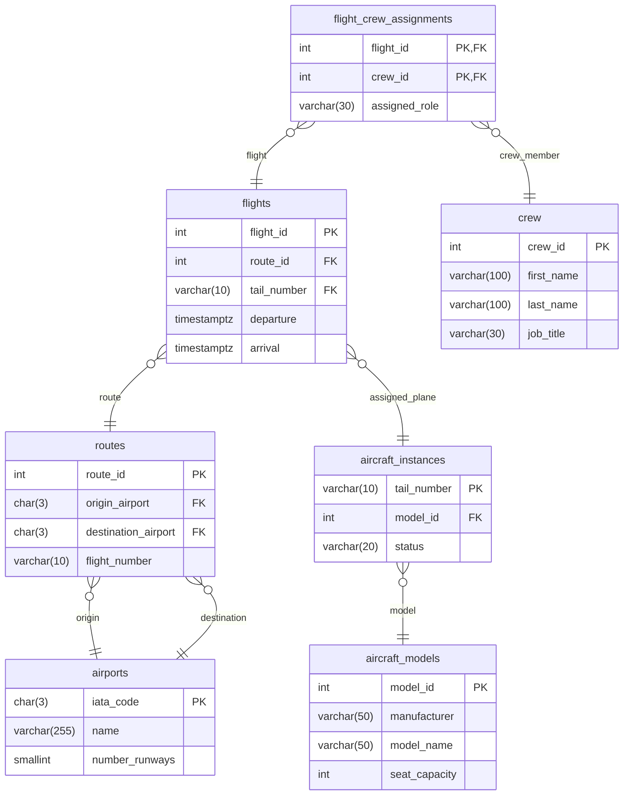
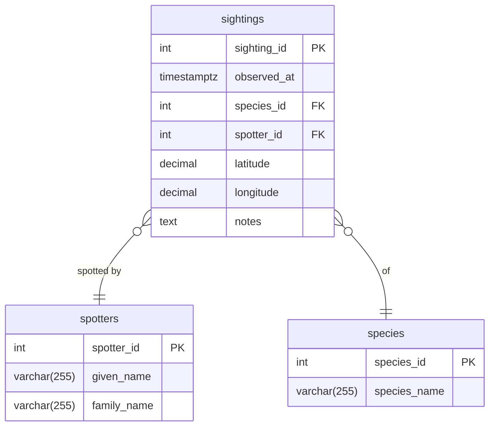

# Databases

- Tailnumber can be null as we create flights before assigning planes
- Add constraints for checking flight times
- Name of crew
- Shouldn't assigned_role be an FK. or drop it altogether just M:M crew to flights

- add conservation status
- somekind of category for the species e.g. mammal