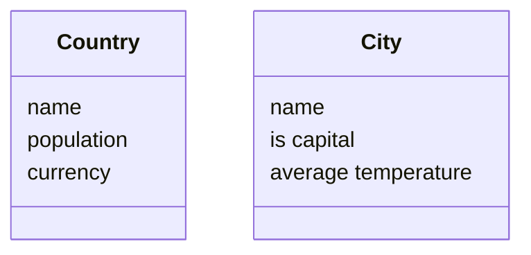
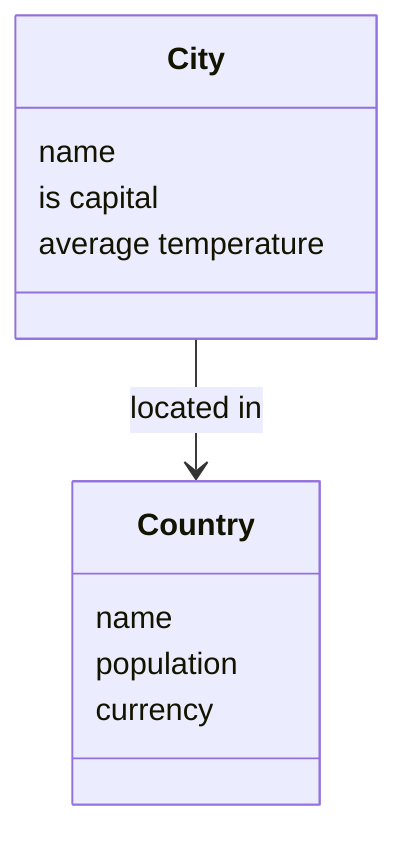
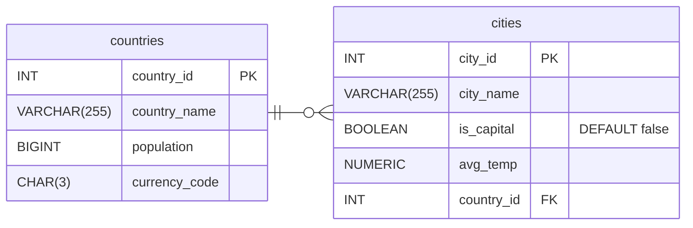
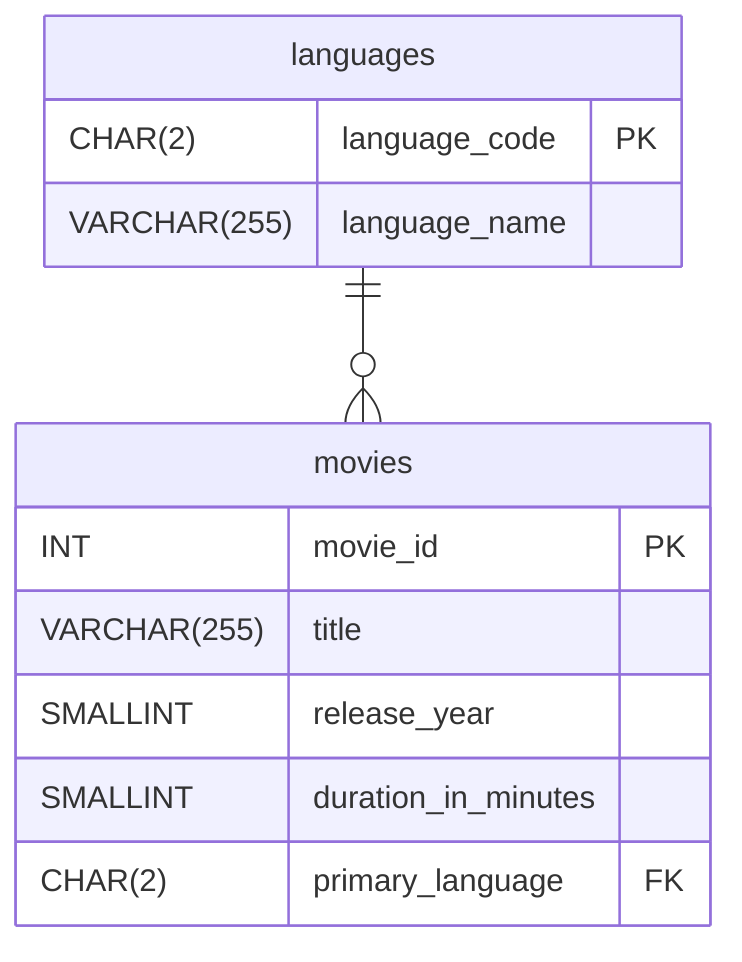
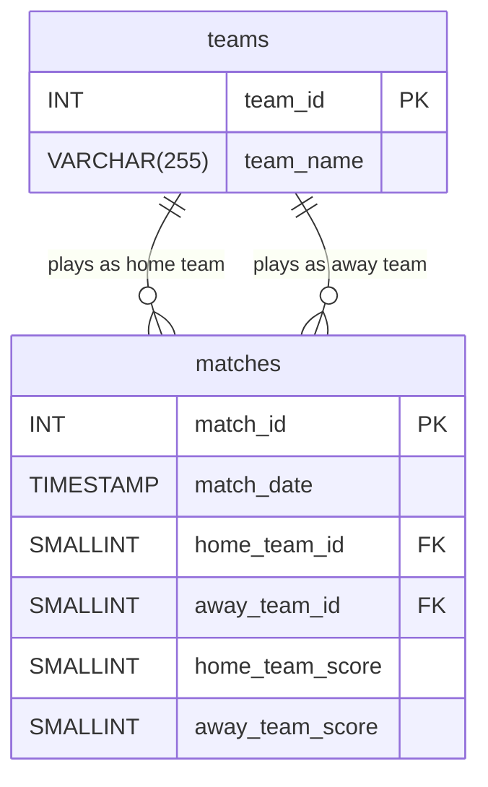

# One-to-Many Relationships

<!-- Last week we said that tables represent entities, things from the real world that we are want to store data about. So we had a students table to store data about students, a movies table to store data about movies.  -->
<!-- We kept things simple, each database had a single table.  -->

So far in the course we have worked with single table databases. In anything other than really simple applications we are going to need more than one table.

Consider building a web application that will act as a travel guide for people wanting to go on a city break. They are going to use the website to help them choose which city to visit.

<!-- Common nouns -->

We'll need to store data about the different cities such as the name of the city, and it's average temperature. We might also want to store data about different countries where cities are located. For example, the name of the country and the currency used. 

So I have two entities _cities_ and _countries_.

We can show this visually on an **ERD**, an **entity relationship diagram**. 



We show entities in boxes, with the name of the entity at the top, and then we display the attributes (columns) below.

There is a relationship between these entities. A city is _located in_ a country. We can show this relationship visually on the diagram. 



The arrow show the direction of the relationship and the label describes the relationship. 

We use verbs to describe relationships. For example a customer _orders_ a product, a footballer _scores_ a goal. 

## Cardinality
Another key thing about relationships is they have **cardinality**. What does this mean? **Cardinality is how many of one thing can be related to the other**.  

Considering the travel guide example we can ask the question

_A city is located in how many countries?_

The answer is **one** e.g. London is located in England, Paris is located in France, Delhi is located in India etc.  

We also need to think about the relationship in the other direction.

_A country contains how many cities?_

The answer is **many** e.g. England contains London, Manchester, Leeds etc. France contains Paris, Lyon, Marseille etc. India contains Mumbai, Dehli, Hyderabad and so on. 

We say there is a **one-to-many** relationship between Country and City.  One country can contain many cities, but a city is located in a single country. We write this as **1:M** or **1:N**. 

There are lots of **1:M** relationships between entities. For example league and football team. A league has many teams, but a team plays in a single league. 

<!-- Car make and model
Phone brand and phone Apple-iphone 12, iphone x iphone se, Samsung galaxy,...footballer and goal -->

## 1:M Relationships in Database Tables
What does this mean for our database tables? We want to store data about relationships as part of our database. In the travel guide example we want to record which country a city is located in. 

**countries**

| country_id | country_name | total_population | currency_code |
| :--- | :--- | :--- | :--- |
| 1 | Germany | 84000000 | EUR |
| 2 | Spain | 48000000 | EUR |
| 3 | Japan | 125000000 | JPY |
| 4 | Canada | 40000000 | CAD |
| 5 | Morocco | 37000000 | MAD |


**cities**

| city_id | city_name | is_capital | avg_temp_celsius | country_id |
| :--- | :--- | :--- | :--- | :--- |
| 1 | Berlin | true | 10.5 | 1 |
| 2 | Munich | false | 9.0 | 1 |
| 3 | Hamburg | false | 9.7 | 1 |
| 4 | Madrid | true | 15.0 | 2 |
| 5 | Barcelona | false | 18.2 | 2 |
| 6 | Tokyo | true | 16.5 | 3 |

In the `cities` table we show which country the city is located in by using the country's primary key value. We can see that Barcelona is located in the country with the `country_id` of 2, it's in Spain. 

We call this a **foreign key**. **A foreign key is a column in a database table that points to the primary key of another table**. 

We can also see that the primary key of single country e.g. Germany can appear in the `cities` table many times. We call the table on the **one** side of the relationship (in this example `countries`) the **parent** table, and we call the table on the **many** side of the relationship (`cities`) the **child** table.

> It's not unusual to get confused about relationships and which side is the **many** and which side is the **one**. By looking at the tables it is easy to see the _country_id_ value appears **many** times in the `cities` table. This clearly indicates `cities` is on the many side of the relationship.  

## Foreign Keys in SQL
How do we implement a 1:M relationship?

The `CREATE` statement for countries is straightforward. 

```sql
CREATE TABLE countries (
country_id INT GENERATED ALWAYS AS IDENTITY,
country_name TEXT NOT NULL,
total_population INT NOT NULL,
currency_code CHAR(3) NOT NULL,
CONSTRAINT pk_countries PRIMARY KEY (country_id)
);
``` 
We have seen very similar `CREATE` statements previously. We haven't seen the `CHAR` data type previously. This is used for a fixed length string. Currency codes are always three letters in length, therefore we can be specific about the size of this column. 


The SQL for creating the cities table.

```sql
CREATE TABLE cities (
  city_id INT GENERATED ALWAYS AS IDENTITY,
  city_name TEXT NOT NULL,
  is_capital BOOLEAN DEFAULT false,
  avg_temp_celsius NUMERIC(3, 1) NOT NULL,
  country_id INT NOT NULL,
  CONSTRAINT pk_cities PRIMARY KEY (city_id),
  CONSTRAINT fk_cities_countries FOREIGN KEY (country_id) REFERENCES countries (country_id)
);
```

There are a couple of new data types we haven't seen before that are worth discussing. 
- `is_capital` will store `BOOLEAN` value i.e. TRUE or FALSE. The `DEFAULT` keyword simply states if an `INSERT` statement doesn't specify a value PostgreSQL will use FALSE as a default.
- `avg_temp_celsius` uses the `NUMERIC` data type for fixed point numbers. The first argument, 3, specifies the total number of digits, the second argument, 1, specifies how many digits are allowed to the left of the decimal point, so this column will allow numbers such as 23.5, 12, -3.2. The number has a single decimal place. 

The important thing to focus on is the foreign key column, `country_id`. 
- When we declare the `country_id` column, we need to make sure we match the data type of the parent table. 
- We also add a constraint that states this is a foreign key. The constraint is given a name _fk_cities_countries_, we specify the foreign key column `FOREIGN KEY (country_id)`, and the table and column it links to `REFERENCES countries (country_id)`. Again, the naming is important. Try and use a consistent clear naming for the constraint e.g. _fk_child_table_parent_table_. 


## A Logical ERD
I can show this 1:M relationship on a logical ERD. It looks a bit different from the ERD we looked at earlier. A logical ERD represents key things about our database structure such as column data types and foreign keys that weren't captured in the earlier conceptual model. Primary keys are shown using PK and foreign keys using FK.



The relationship line has symbols at each end. The 'crow's foot', where it splits into three as it joins the cities table, indicates many.

The short line ( | ) that crosses the relationship line next to the countries table indicates one. 

<!-- This ERD also shows the data types and column names of the final database design. We'll look deeper into ERDs later on in the course.  -->

## Optionality
The diagram also show *optionality*. **Optionality specifies if a relationship is optional or mandatory**. 

Next to the crow's foot there is an inner symbol, a circle. This indicates the relationship is optional for countries. A country can exist in the database without having any associated cities. For example, Canada is in the countries table, but no Canadian cities have been added yet. 

The inner symbol on the countries side, also a short line (|) indicates this relationship is mandatory. A city must be associated with a country. We can't add a city unless we specify the country it is located in. 

## Inserting Data in a 1:M Relationship. 
We have to add records to the countries tables first. If we don't, there won't be any foreign key values to use in the cities table and PostgreSQL will throw an error. 

```sql
INSERT INTO countries (country_name, total_population, currency_code) VALUES
('Germany', 84000000, 'EUR'),
('Spain', 48000000, 'EUR'),
('Japan', 125000000, 'JPY'),
('Canada', 40000000, 'CAD'),
('Morocco', 37000000, 'MAD');
```

We can then populate the `cities` table using foreign key values from the `countries` table. 
```sql
INSERT INTO cities (city_name, is_capital, avg_temp_celsius, country_id) VALUES
('Berlin', true, 10.5, 1),
('Munich', false, 9.0, 1),
('Hamburg', false, 9.7, 1),
('Madrid', true, 15.0, 2),
('Barcelona', false, 18.2, 2),
('Tokyo', true, 16.5, 3);
```

## Referential Integrity
- Foreign keys enforce **referential integrity**. This means when we set up a foreign key two constraints are created:
1. Child tables can only use values for their foreign keys that exist as primary keys in the parent table.
2. Can't delete rows from the parent table if they are being used by the child table.

<!-- 
## Joins 
Querying tables in a 1:M relationship involves using a join. `JOIN` is a command to combine rows from two tables based on a shared column.

We'll do a simple 'SELECT all' to make it clear what a join does.

```sql
SELECT
    *
FROM
    cities
    INNER JOIN countries ON cities.country_id = countries.country_id;
```
| city_id | city_name | is_capital | avg_temp_celsius | country_id | country_id (1) | country_name | total_population | currency_code | 
|---------|-----------|------------|------------------|------------|----------------|--------------|------------------|---------------| 
| 1       | Berlin    | true       | 10.5             | 1          | 1              | Germany      | 84000000         | EUR           | 
| 2       | Munich    | false      | 9                | 1          | 1              | Germany      | 84000000         | EUR           | 
| 3       | Hamburg   | false      | 9.7              | 1          | 1              | Germany      | 84000000         | EUR           | 
| 4       | Madrid    | true       | 15               | 2          | 2              | Spain        | 48000000         | EUR           | 
| 5       | Barcelona | false      | 18.2             | 2          | 2              | Spain        | 48000000         | EUR           | 
| 6       | Tokyo     | true       | 16.5             | 1          | 3              | Japan      | 125000000         | JPY           | 


See how the results show columns from both the cities countries table. Specifically this is an `INNER JOIN`. For each city, we look for the matching `country_id` in the `countries` table and display the country's name. Let's tidy this up to only show the name of the city and the country. 

```sql
SELECT
    cities.city_name,
    countries.country_name
FROM
    cities
    INNER JOIN countries ON cities.country_id = countries.country_id;
```

| city_name | country_name |
| :--- | :--- |
| Berlin | Germany |
| Munich | Germany |
| Hamburg | Germany |
| Madrid | Spain |
| Barcelona | Spain |
| Tokyo | Japan |

 When specifying the columns we want to use for the join and the columns we want to retrieve, we prefix the column name with the table name to make it clear which column we want to retrieve e.g. `countries.country_name`.  

<!-- There are other types of join. We will look at some of these later in the course. 


The order in which we select the tables doesn't matter, I could start with countries instead.  -->

<!-- 
## Filtering and Grouping using a Join
Last week we learnt about sorting, filtering and grouping. These ideas still apply when joining tables e.g. using a `WHERE` clause
```sql
SELECT cities.city_name,
    countries.country_name,
    cities.avg_temp_celsius
FROM cities
    INNER JOIN countries ON cities.country_id = countries.country_id
WHERE cities.avg_temp_celsius > 10
ORDER BY cities.avg_temp_celsius DESC;
```

| city_name | country_name | avg_temp_celsius |
| :--- | :--- | :--- |
| Barcelona | Spain | 18.2 |
| Tokyo | Germany | 16.5 |
| Madrid | Spain | 15.0 |
| Berlin | Germany | 10.5 |

Or using a `GROUP BY`

```sql
SELECT 
countries.country_name, COUNT(cities.city_name) AS num_of_cities
FROM countries
INNER JOIN cities ON countries.country_id = cities.country_id
GROUP BY countries.country_name;
```

| country_name | num_of_cities |
| :--- | :--- |
| Spain | 2 |
| Germany | 3 |
| Japan | 1 |

Note that Canada isn't included in the results. With `INNER JOIN` we only join where there is a match between the parent row and child rows. To display Canada and 0, we'd use a `LEFT JOIN` which we'll learn about in the coming weeks. 

## Using AS
Queries involving joins often end up being much longer than single table queries, we can save some typing and make the SQL clearer by using `AS` and tables aliases.

```sql
SELECT
    c.city_name AS city,
    co.country_name AS country
FROM
    cities AS c
    INNER JOIN countries AS co ON c.country_id = co.country_id;
```
It is common practice to use single letter abbreviations e.g. 'c' for the cities table. In this example, we have two tables that start with a 'c' so I've aliased countries as 'co'. -->

## Some More Examples
Here are some more concrete examples of 1:M relationships

### Languages and Movies
Previously, we looked at a movies database that stored the title, release year, and duration of each film. We can now expand this schema to also record the primary language in which each movie was made. 

This creates a one-to-many (1:M) relationship between languages and movies:
- A single movie is made in **one** primary language. 
- A single language can be used to make **many** different movies. 

> Note on 'Primary Language'. While a film may feature dialogue in multiple languages, primary language refers to the main or primary language in which the movie was produced. 



#### movies

| movie_id | title                          | release_year | duration_in_minutes | primary_language | 
|----------|--------------------------------|--------------|---------------------|------------------| 
| 1        | Casablanca                     | 1943         | 102                 | en               | 
| 2        | Moonlight                      | 2016         | 111                 | en               | 
| 3        | Winter's Bone                  | 2010         | 100                 | en               | 
| 4        | Spirited Away                  | 2001         | 125                 | ja               | 
| 5        | RRR                            | 2022         | 187                 | te               | 
| 6        | Crouching Tiger, Hidden Dragon | 2000         | 120                 | zh               |

#### languages

| language_code | language_name | 
|---------------|---------------| 
| en            | English       | 
| ja            | Japanese      | 
| te            | Telugu        | 
| zh            | Chinese       | 
| da            | Danish        | 
| hi            | Hindi         | 

```sql
SELECT
    m.title,
    m.release_year,
    l.language_name
FROM
    movies AS m
    INNER JOIN languages AS l ON m.primary_language = l.language_code;
```

| title                                               | release_year | language_name | 
|-----------------------------------------------------|--------------|---------------|  
| Fish Tank                                           | 2009         | English       | 
| Planet of the Apes                                  | 1968         | English       | 
| Shin Godzilla                                       | 2016         | Japanese      | 
| RRR                                                 | 2022         | Telugu        | 
| In the Mood for Love                                | 2000         | Chinese       |


#### This example doesn't use a surrogate key
Previously we have always used a surrogate primary key e.g. `movie_id`, `city_id`, `student_id`. In the `languages` table, we use a two-letter language code as the primary key instead of an ID number. This is a 'natural' key, it stores data that exists in the real-world. A language code is used as the primary key because it uniquely identifies each language, remains compact at just two characters, and offers the advantage of being descriptive. When viewed as a foreign key in another table, we can often instantly recognize the language without needing to look-up an ID value in a separate table.

### Football Teams and Matches
Think about the relationship between football teams and matches:
- A single team plays in **many** matches. 
- A single match is played by **two** teams. 

We can differentiate between the home team and away team that play in a match giving us two distinct one-to-many relationships.
1. A single team plays as the home team in **many** matches. A single match is played by **one** home team. 
2. A single team plays as the away team in **many** matches. A single match is played by **one** away team. 

In the _matches_ table we will need two foreign keys. One for the home team. One for the away team. 


The tables might look like the following:

**teams**
| team_id | team_name           | 
|---------|---------------------| 
| 1       | Real Madrid         | 
| 2       | Manchester City     | 
| 3       | Barcelona           | 
| 4       | Paris Saint-Germain | 
| 5       | Liverpool           | 
| 6       | Roma                | 

**matches**
| match_id | match_date          | home_team_id | away_team_id | home_team_score | away_team_score | 
|----------|---------------------|--------------|--------------|-----------------|-----------------| 
| 1        | 2017-03-08 20:45:00 | 3            | 4            | 6               | 1               | 
| 2        | 2019-05-07 21:00:00 | 5            | 3            | 4               | 0               | 
| 3        | 2022-05-04 21:00:00 | 1            | 2            | 3               | 1               | 
| 4        | 2018-04-10 20:45:00 | 6            | 3            | 3               | 0               | 

We use `TIMESTAMP` to store the exact time and date of the football match. The `TIMESTAMP` data type used to record a precise, specific moment in time. We can think of it as a combination of date and time.

We can query by joining the `matches` table to the `teams` table twice.

```sql
SELECT
    h.team_name AS home_team,
    a.team_name AS away_team,
    m.home_team_score AS home_score,
    m.away_team_score AS away_score,
    m.match_date AS date
FROM
    matches AS m
    INNER JOIN teams AS h ON m.home_team_id = h.team_id
    INNER JOIN teams AS a ON m.away_team_id = a.team_id;
```

| home_team           | away_team           | home_score | away_score | date                | 
|---------------------|---------------------|------------|------------|---------------------| 
| Barcelona           | Paris Saint-Germain | 6          | 1          | 2017-03-08 20:45:00 | 
| Liverpool           | Barcelona           | 4          | 0          | 2019-05-07 21:00:00 | 
| Real Madrid         | Manchester City     | 3          | 1          | 2022-05-04 21:00:00 | 
| Roma                | Barcelona           | 3          | 0          | 2018-04-10 20:45:00 | 


