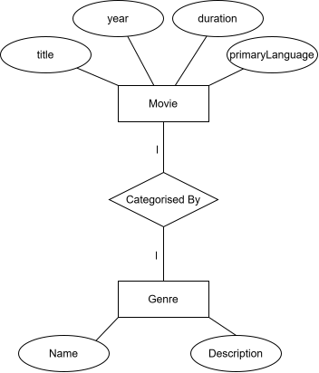
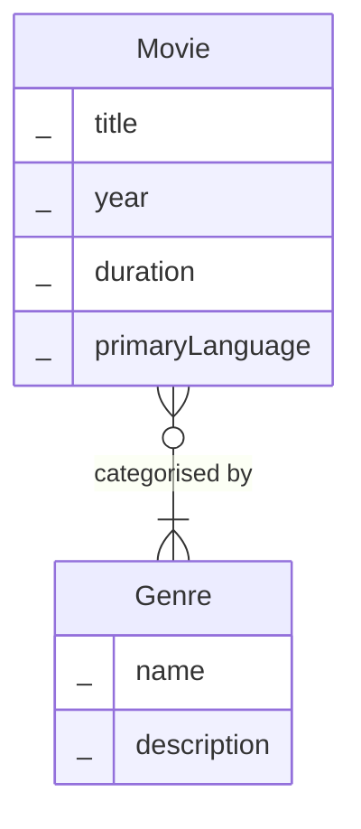

# Creating ERDs

## ERD Notations
There are two main ways to draw ERDs

### 1. Chen's Notation
This was developer by Peter Chen in 1975.
- Entities are drawn as rectangles.
- Attributes are drawn as ovals connected to entities.
- Relationships are drawn as diamonds linking entities.

Here's an example.

#### Conceptual ERD Using Chen's Notation


Chen's notation was traditional used in academia. You will still see Chen's notation used in many examples. I've included it here so that if you see similar diagrams, you aren't confused. 

### 2. Crow's Foot Notation
This is the notation we have been using on the course.

#### Conceptual ERD Using Crow's Foot Notation
<pre class="mermaid">
erDiagram
    accTitle: Logical model showing crow's foot notation.
    accDescr: Logical model showing Movie and Genre entities.
    Movie }o--|{ Genre : "categorised by"
    Movie {
        _ title
        _ year
        _ duration
        _ primaryLanguage
    }
    Genre{
        _ name
        _ description
    }
</pre>

This is the most popular method used by most software engineers and database designers today.

We will be using Crow's foot notation throughout the course. For your assessments you will need to create your ERDs using Crow's Foot notation. 

## How Do I Create The Diagrams?
There are lots of different ways in which we can create ERDs. The two main approaches I would recommend are as follows. 

### 1. Code-Based Tools
All the notes on this course have been written using Markdown with Mermaid.js has been used to create the diagrams. For example, here's the code used to create the conceptual ERD shown above.

#### Example Mermaid.js Code For Creating ERDs
```
#### Conceptual ERD Using Crow's Foot Notation

With code based tools we write the components of the diagram, entities, attributes, relationships etc. using code. The diagram gets created for us automatically. Although it takes a bit of time to learn how to create the diagrams. In the long run, this is a faster way of creating diagrams. There are a number of code based tools we can use.

#### *Markdown and Mermaid.js*
We create Mermaid.js diagrams as part of Markdown documents. 
- To learn Markdown
  - https://www.markdowntutorial.com/
  - https://www.markdownguide.org/basic-syntax/
- Mermaid.js
  - Mermaid.js is a general purpose diagramming tool. it can be used to create many different types of diagram. For documentation on creating ERDs see https://mermaid.ai/open-source/syntax/entityRelationshipDiagram.html.
  - The diagram becomes part of the Markdown document.

If you want to use this approach my advice is to use your own local version of VS Code. VS Code is free to download and easy to install.  

You then need to add some extensions to handle Markdown and Mermaid. 
- Markdown Preview Mermaid Support. 
- Markdown All in One.

You can then write your assignment using Markdown and export it as a .pdf to submit it. 

#### dbdiagram.io (https://dbdiagram.io/) and Export the Image as SVG/PNG 
  - dbdiagram.io is an online editor that allows us to create ERDs using code. 
  - Can import SQL code and generate diagrams
  - Can export diagram as SQL code or as a PDF or image.
  - You can then insert the image into Word when writing your report.  

### 2. Visual Drag and Drop Tools
These work like a tools such as PowerPoint. Users drag boxes and lines onto a canvas, add text and link elements together to build up diagrams. They have the advantage of being a little easier to work with initially. However, it can be time-consuming to create larger more complex diagrams. There are many online editors. They tend to be general purpose diagramming tools, so you will need to find the database/ERD specific shapes. I would recommend https://www.drawio.com/. It is free and doesn't require a sign-up. Again you can export the images. 


