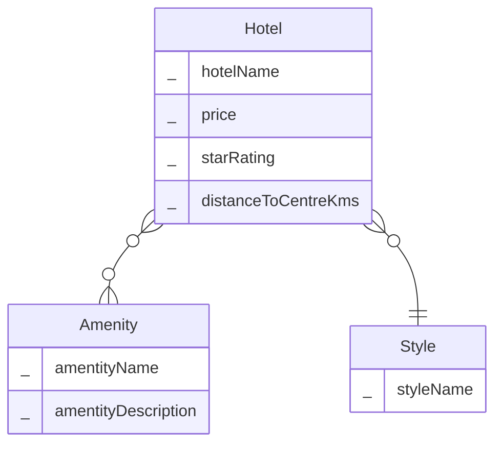
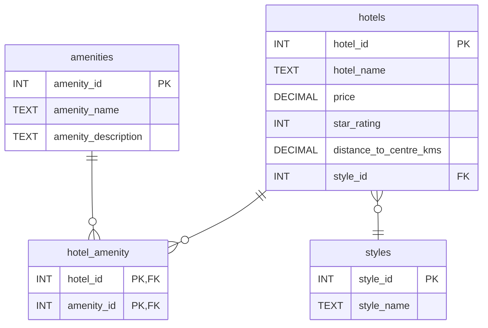

# Possible Solution: Database Design for a Hotel Finder App

## Conceptual ERD

**Conceptual ERD for the Hotel Finder App**

Your solution may not look exactly like this. You've probably named things a little differently. Here are the key things to check:-

- Your conceptual ERD only models real world entities. There shouldn't be any mention of primary keys, foreign keys etc.
- You've correctly identified that there is a many-to-many relationship between Hotel and Amenity. 
- You may not have modelling Style as a separate entity. You might have simply added a style attribute to the Hotel entity. This is fine. I'll explain why I've chosen to create a separate Style entity in the next reading task. 

## Logical ERD

**Logical ERD for the Hotel Finder App**

Again, your answer may not be identical to this diagram. Here are the key things to check:
- The logical ERD should be consistent with the conceptual ERD. 
- Tables and columns have been named using a consistent naming convention.
- The diagram shows primary and foreign keys.
- The diagram shows suitable data types.
- There is a junction table for the many-to-many relationship.