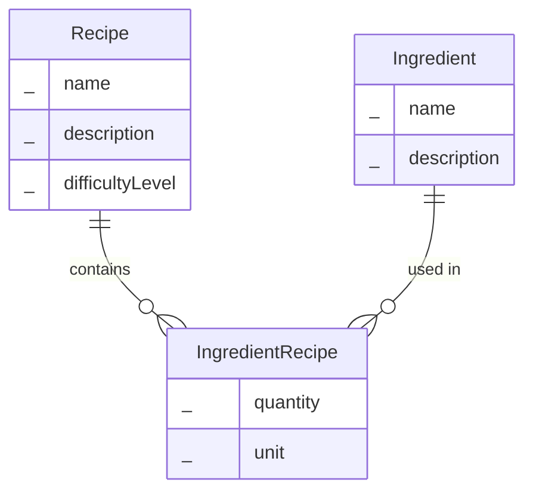
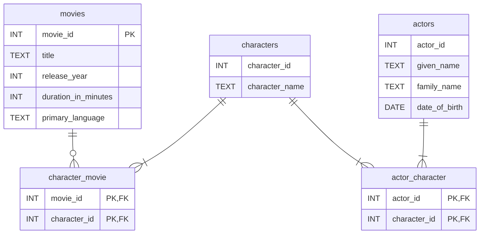
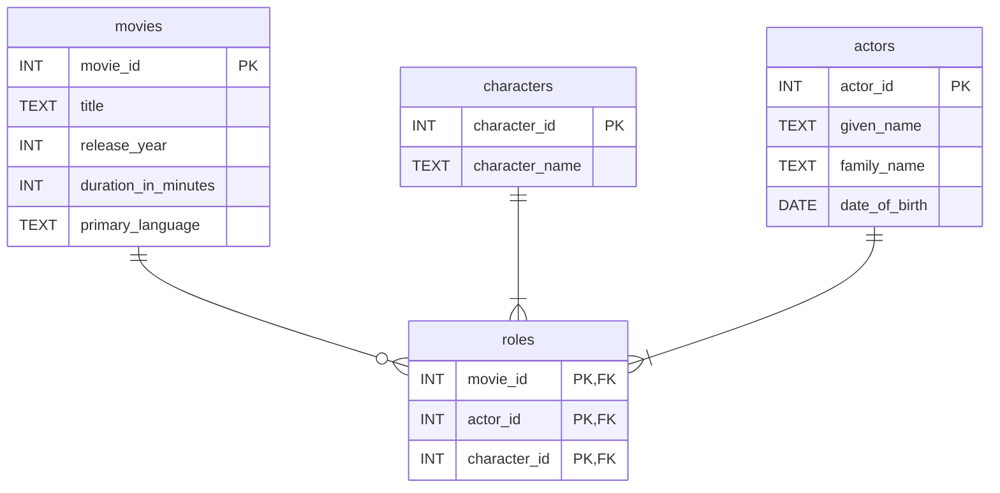
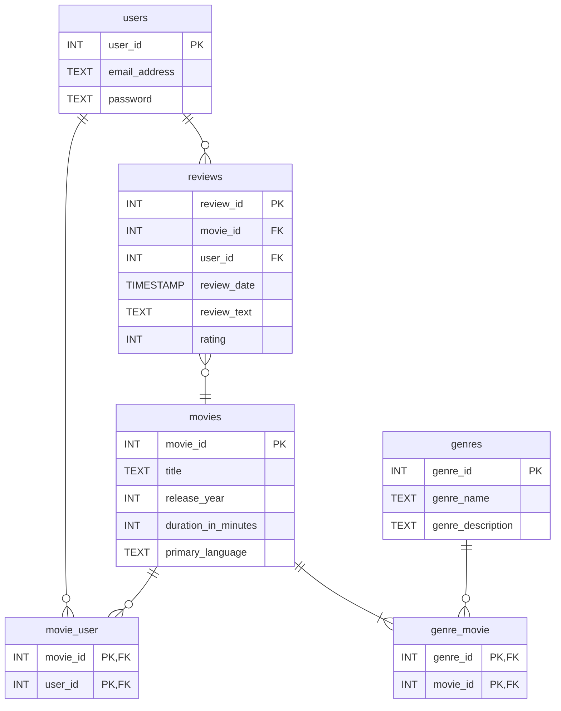
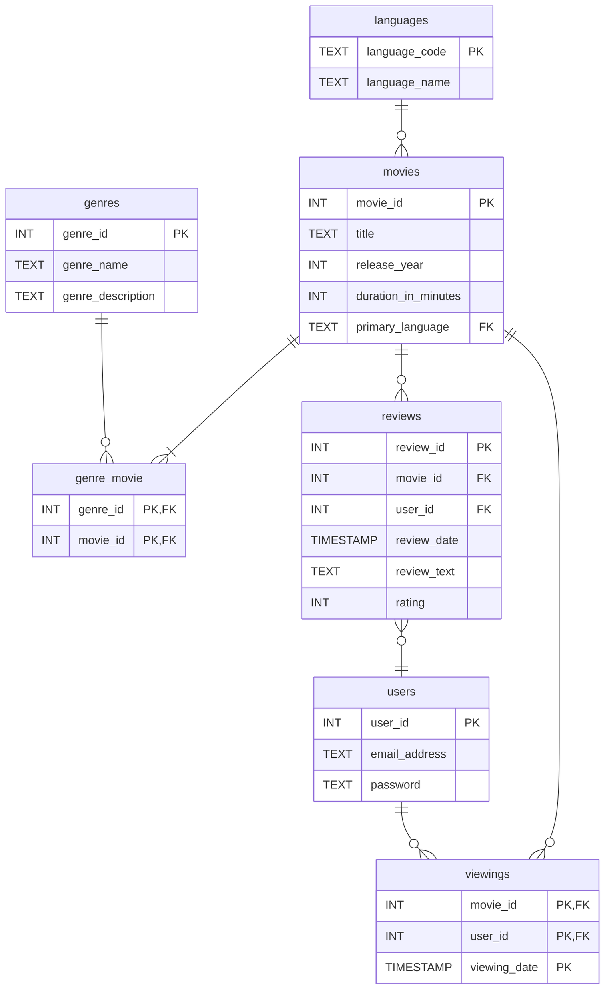

# Beyond the Basics: Solving Common Design Problems

The following considers commonly encountered scenarios when designing databases and practical solutions. 

## Using Look Up Tables
In the hotel finder application we needed to store the category of hotel (boutique, business, budget, luxury). In many ways it makes sense to specify this as an attribute of hotel, in a column named `style`.

However, when we have a restricted list of values such as this we are going to end up with lots of duplication in our database.

**hotels**

|hotel_id (PK)|hotel_name |price|star_rating|distance_to_centre_kms|style|
|:------------|:----------|:----|:----------|:---------------------|:---------|
| 1 | The Grand Luminary | 249.99 | 5 | 0.40 | Luxury |
| 2 | Urban Nest Suites | 115.50 | 4 | 1.85 | Boutique |
| 3 | Metro Plaza Hotel | 140.00 | 4 | 0.80 | Business |
| ... | ... | ... | ... | ... |... | ... |
| 9 | Apex Executive Hub | 155.00 | 4 | 0.60 | Business |
| 10 | Velvet Rose Boutique | 195.00 | 5 | 0.20 | Bootique |
| 11 | Earthy Roots Cabins | 95.00 | 3 | 22.00 | Eco-Lodge |

This creates problems as whenever an administrator enters the details of a new hotel we are relying on them to enter the style of hotel in exactly the same way it was done previously. Human error will inevitably happen, and we might end up with 'Boutique' being entered as 'Bouteek', 'boutique', 'Bootique' etc.

For this reason whenever we have a restricted list of possible values we should create a separate table and use a foreign key to specify which value to use.

### Improved Design 

**styles**

| style_id | style_name |
| :--- | :--- |
| 1 | Boutique |
| 2 | Luxury |
| 3 | Budget |
| 4 | Business |
| 5 | Eco-Lodge |
| 6 | Historic |

**hotels**

| hotel_id | hotel_name | price | star_rating | distance_to_centre_kms | style_id |
| :--- | :--- | :--- | :--- | :--- | :--- |
| 1 | The Grand Luminary | 249.99 | 5 | 0.40 | 2 |
| 2 | Urban Nest Suites | 115.50 | 4 | 1.85 | 1 |
| 3 | Metro Plaza Hotel | 140.00 | 4 | 0.80 | 4 |
| .. | ... | ... | ... | ... | ... |
| 9 | Apex Executive Hub | 155.00 | 4 | 0.60 | 4 |
| 10 | Velvet Rose Boutique | 195.00 | 5 | 0.20 | 1 |
| 11 | Earthy Roots Cabins | 95.00 | 3 | 22.00 | 5 |
| 12 | The Heritage Palace | 280.00 | 5 | 1.50 | 6 |

We can then use a join to get the style for each hotel.

You may think that we have simply replaced duplicate hotel styles with duplicate ID numbers instead. However, this design is much better. We only ever store the text of each style once and we now have referential integrity. If we try and insert a new hotel and don't use a valid ID from the `styles` table, PostgreSQL will throw an error.

Furthermore, this design is more flexible. For example, if we wanted to provide a brief explanation of what we mean by a boutique hotel it is easy to add an additional column in the `styles` table.

> Be wary of needlessly creating separate tables for single attributes. Generally attributes describes an entity and should be columns in the table that represents the entity.

## Associative Entities (Relationships as Entities)

What is the cardinality of the relationship between these entities?
- Recipe - Ingredient
- Student - Assignment
- Customer - Flight
- Product - Order

They are all M:M relationships. For example, A recipe can feature many ingredients, and an ingredient can be part of many different recipes. 

Often, when we have a many-to-many relationship, there is data that we want to store as part of the relationship. 

- Recipe - Ingredient
  - Need to store the quantity and unit (grams, cups, spoons etc.) of the ingredient.
- Student - Assignment
  - Need to store the submission date and score.
- Customer - Flight
  - Need to store the row and seat number, and date of the booking.
- Product - Order
  - Need to store how many products were ordered and the price of the product. 

When we need to store data as part of a relationship, the relationship becomes an entity. We call these **associative entities**. They are a little harder to spot than common nouns. If we look at a many-to-many relationship and think we need to store additional data such as how many? when? or where? Then it's a sign we have identified an associative entity.

**Conceptual ERD Showing an Associative Entity**

### Naming Associative Entities
Sometimes associative entities can be named easily e.g. *Booking* describes the relationship between *Customer* and *Flight*, *Submission* describes the relationship between *Student* and *Assignment*. 

On other occasions, there isn't an immediately obvious name we should use. In such cases, we typically use a combination of the two parent entity names e.g. *IngredientRecipe*. 

## N-ary Relationships
Imagine we want to store data about characters and actors as part of the My Movie Diary example.

My tables would look like the following:

**movies**

| movie_id | title | release_year | duration_in_minutes | primary_language |
| :--- | :--- | :--- | :--- | :--- |
| 1 | Casablanca | 1942 | 102 | English |
| ... | ... | ... | ... | ... |
| 67 | Joan of Arc | 1948 | 145 | English |
| 68 | The Messenger: The Story of Joan of Arc | 1999 | 148 | English |

 **characters**

| character_id | character_name |
| :--- | :--- |
| 23 | Ilsa Lund |
| 24 | Rick Blaine |
| ... | ... |
| 503 | Joan of Arc |

 **actors**

| actor_id| given_name | family_name | date_of_birth |
| :--- | :--- | :--- | :--- |
| 11 | Humphrey | Bogart | 1899-12-25 |
| 12 | Ingrid | Bergman | 1915-08-29 |
| ... | ... | ... | ... |
| 913 | Milla | Jovovich | 1975-12-17 |

**character_movie**

| movie_id | character_id |
| :--- | :--- |
| 1 | 23 |
| 1 | 24 |
|...|...|
| 67 | 503 |
| 68 | 503 |

**actor_character**

| actor_id | character_id |
| :--- | :--- |
| 11 | 24 |
| 12 | 23 |
| 12 | 503 |
|...|...|
| 913 | 503 |

Imagine we are querying the database and we want to know who played the role of *Rick Blaine* in the movie *Casablanca*? 

If we follow from the `characters` table through the junction table (`actor_character`) to the `actors` table we can see that the character of *Rick Blaine* (ID=24) was played by *Humphrey Bogart* (ID=11). At face value this appears to be a well-designed database. 

What about 'Who played the role of Joan of Arc in the movie *The Messenger: The Story of Joan of Arc*?'

We can't be sure. Based on these tables we know the character *Joan of Arc* (ID=503) appeared in the movie. We also know this character was played by two different actors (ID=12 and ID=913), but we don't know which actor played the role in the 1999 movie and which actor played the role in the 1948 movie. 

What we have is a relationship between three different entities: *movies*, *characters* and *actors*. 

**Logical ERD Showing a Ternary Relationship**

The `roles` table captures the relationship between three entities. There is a composite PK that uses the ID numbers from three different tables. 

**roles**

|movie_id (PK)| actor_id | character_id |
|:-------| :--- | :--- |
|1        | 11 | 24 |
|1        | 12 | 23 |
|67        | 12 | 503 |
|...        |...|...|
|68        | 913 | 503 |

We can see that `actor_id` = 913 (Milla Jovovich) played the role of Joan of Arc in the movie *The Messenger: The Story of Joan of Arc*?'

Previously all the relationships we have looked at have been between two entities. They have been binary relationships. 

This movies-characters-actors relationship is between three entities, it is a ternary relationship. 

We use the term **n-ary relationship** to describe any relationship that involves more than two entities. n-ary relationships aren't that common, most relationships are binary relationship, but you should be aware of them. 

## Revisiting the My Movie Diary Example
Previously we created the following model.

Now that we know about look-up tables and associative entities, we can improve the design.

I have made two key changes.

1. Created a separate `languages` look-up table. This will remove duplicate language names from the `movies` table.
2. It would be good to record when the user watched a movie. Therefore we need to store the time and date of the viewing as part of the relationship between `movie` and `user`. To implement this, I have replaced the `movie_user` junction table with an associative entity, a `viewings` table. 

#### This example doesn't use a surrogate key
Previously we have always used a surrogate primary key e.g. `movie_id`, `city_id`, `student_id`. In the `languages` table, we use a three-letter language code as the primary key instead of an ID number. This is a 'natural' key, it stores data that exists in the real-world. A language code is used as the primary key because it uniquely identifies each language, remains compact at just three characters, and offers the advantage of being descriptive. When viewed as a foreign key in another table, we can often instantly recognize the language without needing to look up an ID value in a separate table.

Another design choice I have made is naming the foreign key column `primary_language`. Previously we have always named our foreign key columns to match the primary key they reference. In this example, I have chosen `primary_language` as this is more descriptive. Although a movie may feature dialogue in many different languages, this makes it clear it is the main language the movie has been made in. 

**movies**

| movie_id (PK) | title                          | release_year | duration_in_minutes | primary_language (FK) | 
|----------|--------------------------------|--------------|---------------------|------------------| 
| 1        | Casablanca                     | 1943         | 102                 | eng              | 
| 2        | Moonlight                      | 2016         | 111                 | eng              | 
| 3        | Winter's Bone                  | 2010         | 100                 | eng              | 
| 4        | Spirited Away                  | 2001         | 125                 | jpn              | 
| 5        | RRR                            | 2022         | 187                 | tel              | 
| 6        | Crouching Tiger, Hidden Dragon | 2000         | 120                 | zho              |

**languages**

| language_code (PK) | language_name | 
|---------------|---------------| 
| eng           | English       | 
| jpn           | Japanese      | 
| tel           | Telugu        | 
| zho           | Chinese       | 
| dan           | Danish        | 
| hin           | Hindi         | 