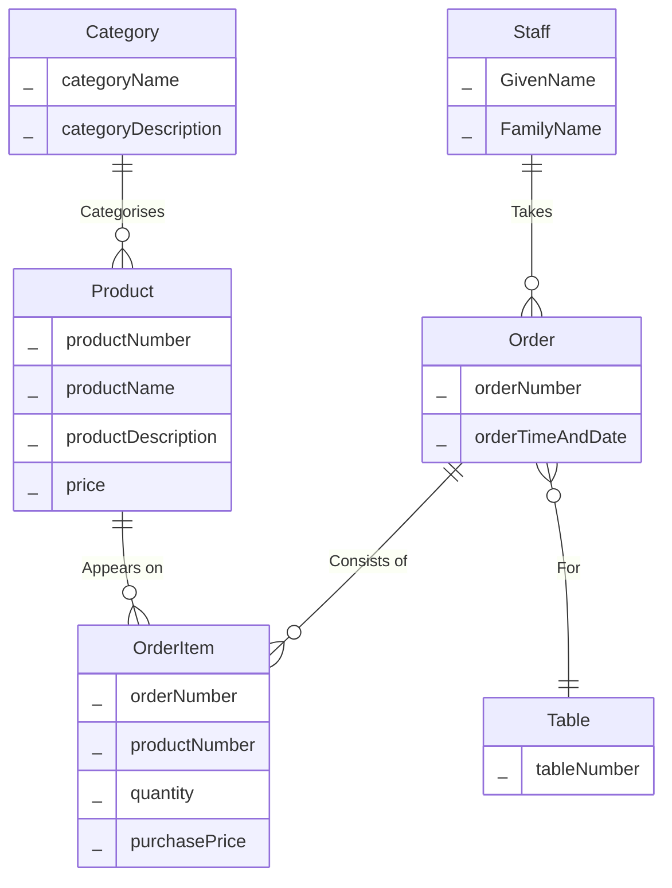
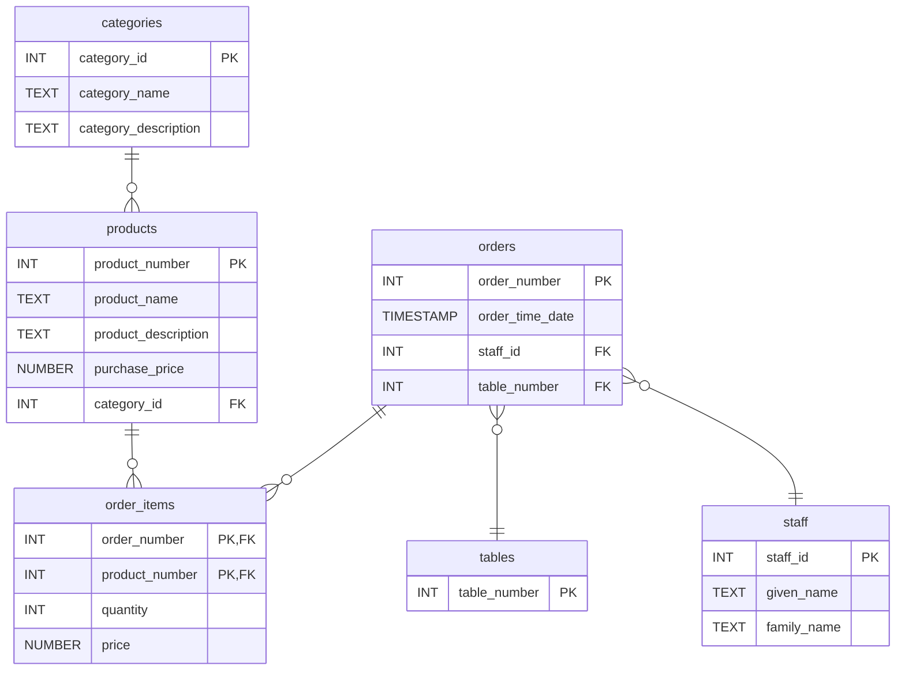

# Solution: Database Design Coffee Shop

## Conceptual ERD

#### Conceptual ERD for the Coffee Shop Scenario

Your solution may not look exactly like this. For example, you've probably named things a little differently. Here are the key things to check:-

- Your conceptual ERD only models real world entities. There shouldn't be any mention of primary keys, foreign keys etc.
- You've correctly identified the one-to-many relationship between *Category* and *Product*, between *Order* and *Table*, and between *Staff* and *Order*.
- Capturing exactly how to record the order details is a bit trickier. *OrderItem* is an associative entity, it captures data about the relationship between a product and an order i.e. how many products were ordered and the purchase price. 

## Logical ERD

#### Logical ERD for the Coffee Shop Example

If you get the conceptual model right, the logical model should be fairly easy to produce. It should simply be a case of resolving M:M relationships (there aren't any), adding PKs and FKs and data types. 

It might seem like _purchased_price_ isn't necessary, we can get this from the *products* table. However, if the price of a product changes, the *order_items* table has a record of the price at the time of the order.  