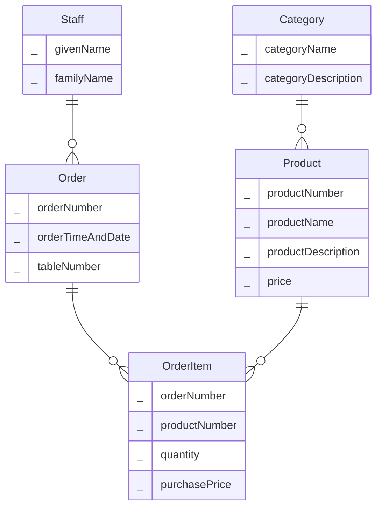
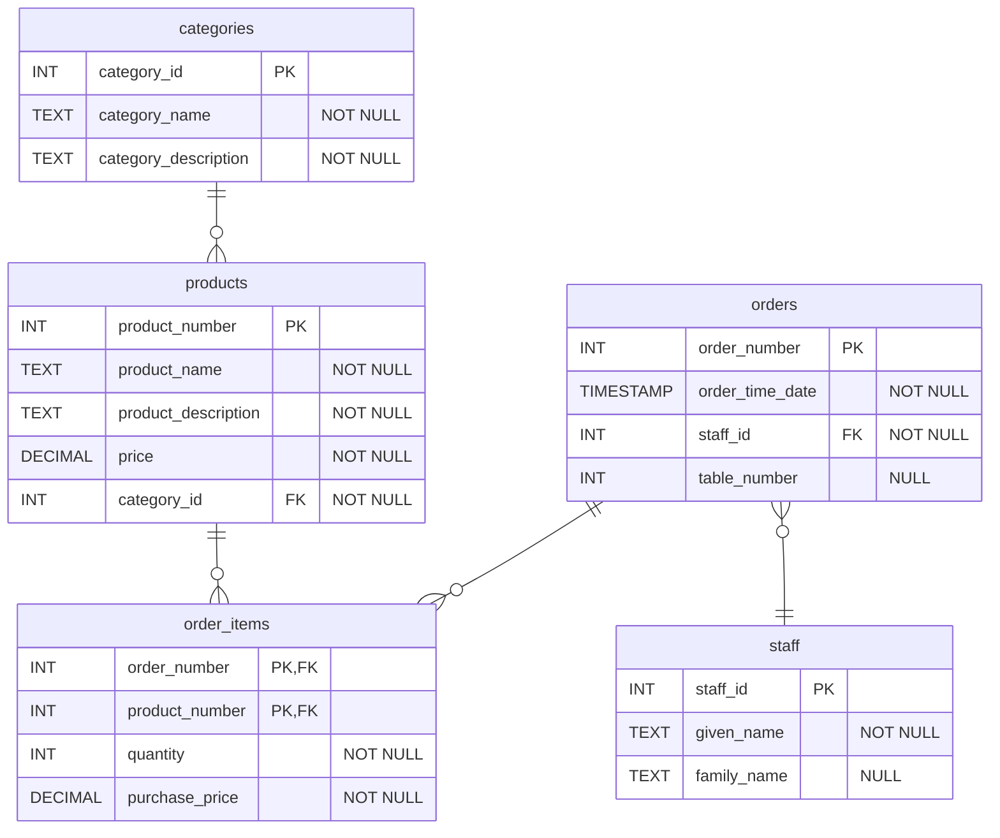

# Exercise: Independent Coffee Shop Database Design

A small independent coffee shop need a database to keep track of orders and sales. The coffee shop sells a range of hot and cold drinks (teas, coffee, soft drinks etc.). They also sell a limited selection of food items, mainly cakes and pastries. Each product has a name (e.g. Americano), category (e.g. coffee) and price (e.g. 2.50). Whenever a customer makes an order, there needs to be a full record of the order including a complete list of all the items that were ordered, the staff member that took the order, the table number, and the time and date of the order. 

1. Create a conceptual ERD that capture the key entities, their attributes and relationships in this description. 

2. Based on your conceptual ERD create a logical ERD. This should specify primary and foreign keys, data types, and junction tables if you have any many-to-many relationships. 

Based on the description, you may assume some additional attributes that aren't explicitly mentioned. However, don't be tempted to expand the scenario e.g. by considering payments. Only model the entities described in the description. 

You can use any tool you like to create the ERDs. For this introductory exercise you could hand draw the ERD. Alternatively, you could use on online diagram editor such as https://www.drawio.com/ or https://dbdiagram.io/. 

In the notes we also looked at creating data dictionaries. To keep things simple and so the exercise doesn't take too long, don't worry about creating data dictionaries, or a physical data model.  

## Possible Solution

### Conceptual ERD

Your solution may not look exactly like this. For example, you've probably named things a little differently. Here are the key things to check:-

- Your conceptual ERD only models real world entities. There shouldn't be any mention of primary keys, foreign keys etc.
- You've correctly identified the one-to-many relationship between *Category* and *Product* and between *Staff* and *Order*.
- Capturing exactly how to record the order details is a bit trickier. *OrderItem* is an associative entity, it captures data about the relationship between a product and an order i.e. how many products were ordered and the purchase price. 

### Logical ERD

If you get the conceptual model right, the logical model should be fairly easy to produce. It should simply be a case of resolving M:M relationships (there aren't any), adding PKs and FKs and data types. 

Here are some additional points worth discussing:-
- It might seem like `purchase_price` is an unnecessary duplication, we can get this from the `products` table. However, if the price of a product changes, the `order_items` table has a record of the price at the time of the order. 
- You may have modelled Table as a separate entity. This would also be a suitable design, and would have the advantage of being more flexible, as it would be easy to add additional attributes for Table later. I have modelled it as an attribute of Order as it keeps things simpler. 
- I have made `table_number` nullable. The shop probably allows take-out orders. In which case, there won't be a table number. 