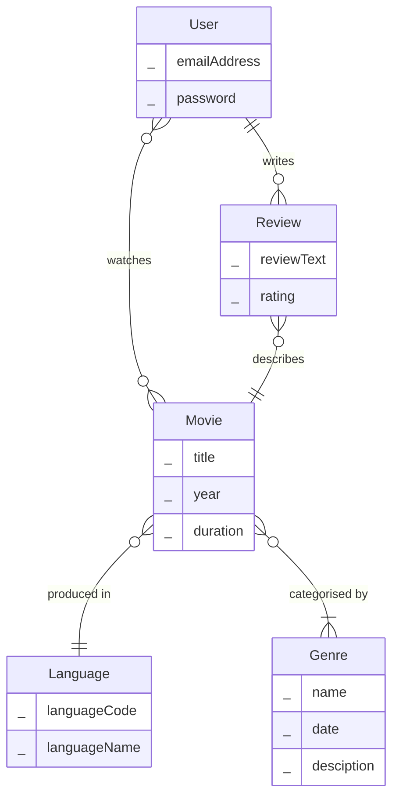
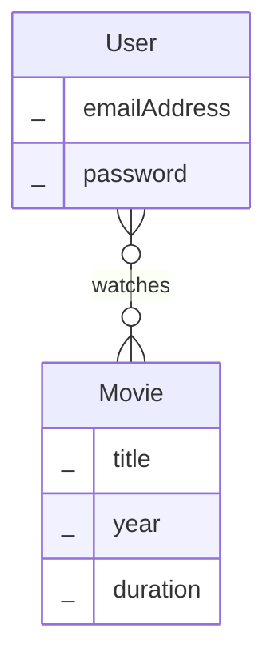
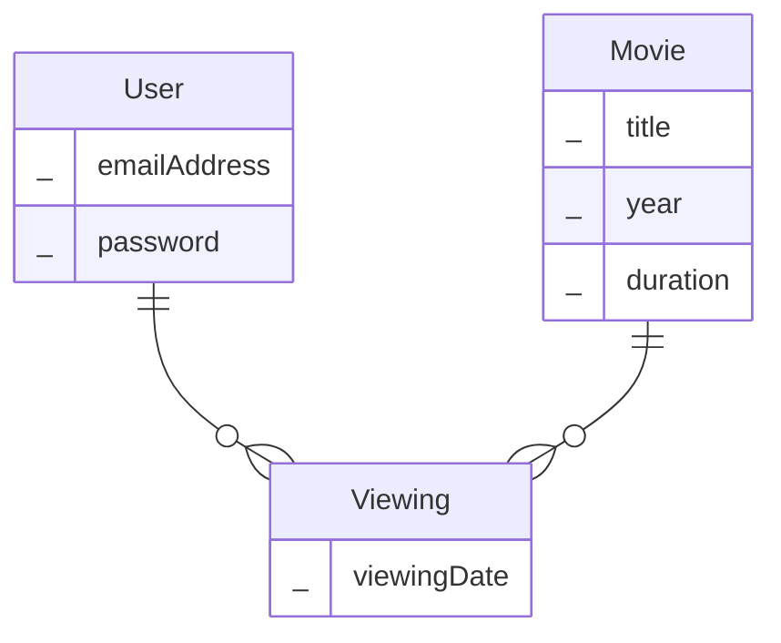

# Database Design

## Using Look-up Tables
In the hotel example we needed to store the style of hotel (boutique, business, budget, luxury). Intuitively, it makes sense to store this as a column in the **hotels** table. 

### **hotels** 

| hotel_id | hotel_name | price | star_rating | style |
| :--- | :--- | :--- | :--- | :--- |
| 1 | The Grand Plaza | 245.50 | 5 | Luxury |
| 2 | Neon Lights Inn | 89.00 | 3 | Boutique |
| 3 | Metro Stay & Suites | 120.00 | 4 | Business |
| 4 | Backpackers Hub | 35.00 | 1 | Budget |
| 5 | Velvet Oasis Resort | 310.75 | 5 | Luxury |
| 6 | The Cobblestone House | 145.00 | 4 | Boutique |

If we do this, we will end up with lots duplication in our database. The same values (e.g. Luxury, Business etc.) are going to be entered again and again.  Every time a user enters the details of a new hotel we are relying on them inputting the style of hotel in exactly the same way. Obviously, human error is going to come into play, and we might end up with Boutique being entered as Bouteek, Bootique, boutique etc.

For this reason, whenever we have a restricted list of possible values we should always create a separate table and use 1:M relationship, and a foreign key to specify which value to use.

### **styles** (Parent Table)

| style_id | style_name |
| :--- | :--- |
| 1 | Luxury |
| 2 | Boutique |
| 3 | Business |
| 4 | Budget |

### **hotels** (Child Table)

| hotel_id | hotel_name | price | star_rating | style_id |
| :--- | :--- | :--- | :--- | :--- |
| 1 | The Grand Plaza | 245.50 | 5 | 1 |
| 2 | Neon Lights Inn | 89.00 | 3 | 2 |
| 3 | Metro Stay & Suites | 120.00 | 4 | 3 |
| 4 | Backpackers Hub | 35.00 | 1 | 4 |
| 5 | Velvet Oasis Resort | 310.75 | 5 | 1 |
| 6 | The Cobblestone House | 145.00 | 4 | 2 |

This might not seem to fit with the database design process we discussed previously. 'Style' doesn't seem to be an entity, it feels more like an attribute. I've created a table with just two columns. And you may correctly point out that we have simply removed the duplicate hotel styles and replaced them with duplicate ID numbers. 

However, this design is much better as we have referential integrity. If we try and insert a new hotel and don't use a valid ID from the styles table, PostgreSQL will throw an error. We ensure data consistency as we only ever enter the style once.

There is a second advantage. This design is more flexible, for example if we wanted to provide a brief explanation of what we mean by a boutique hotel, it's much easier to add an additional 'description' column to the **styles** tables than adding an additional column to the **hotels** table and updating every row with more duplicating data. 

A table like _styles_ is referred to as a look-up table. 

Going back to the My Movie Diary example. The primary language for a movie is a good candidate for moving into a look-up table. The same value for language will appear in multiple rows. 

> This is exactly what we did last week when looking at relationships

## Associative Entities (Relationships as Entities)

Whenever we have a many-to-many relationship between entities, we might want to store some data as part of this relationship. 

Going back to the My Movie Diary example. Users need to be able to keep track of the movies they have watched. We modelled this as a many-to-many relationship.

We might want to store some additional data as part of this relationship. For example, it would be a good to know when the user watched a particular movie. To do this we are going to need a new Viewing entity

We call this an **associative entity**. Associative entities are sometimes harder to spot at the requirements gathering stage. If you can point to relationship and ask questions such as 'How much?', 'When?' or 'Where?' then the relationship line is secretly an entity in disguise.

Here are some more many-to-many relationships that are hiding associative entities and the additional data we might want to store.  

- Recipe:Ingredient
    - We need to store the quantity and the unit of measurement (e.g., grams, spoons) of the ingredient used in that specific recipe.
- Student:Assignment
    - We need to record the mark the student achieved and the date they submitted the assignment.
- Product:Order
    - We need to know the quantity of products ordered, and importantly, the exact price of the product at the time of purchase to ensure records remain accurate if prices change later.

Here's what the tables for tracking orders might look like:-

### **products** (Parent Table)

| product_id | product_name | current_price | stock_level |
| :--- | :--- | :--- | :--- |
| 101 | Wireless Mouse | 25.00 | 150 |
| 102 | Mechanical Keyboard | 85.00 | 45 |
| 103 | HDMI Cable (2m) | 12.50 | 300 |

### **orders** (Parent Table)

| order_id | customer_id | order_date | order_status |
| :--- | :--- | :--- | :--- |
| 5001 | 99 | 2026-06-28 | Shipped |
| 5002 | 42 | 2026-06-29 | Processing |

### **order_lines** (The Associative Entity Table)

order_line_id| order_id (FK) | product_id (FK) | purchased_price |
|:-----------| :-------------| :---            | :-------------- |
|1           | 5001          | 101             | 25.00           |
|2           | 5001          | 103             | 12.50           |
|3           | 5001          | 103             | 12.50           |
|4           | 5002          | 102             | 85.00           |
|5           | 5002          | 103             | 12.50           |

<!-- The alternative was of doing this with a compositie primary key and a quantity column. -->

The **order_lines** table is just like the junction tables we have seen before for implementing many-to-many relationships. We've simply added a surrogate primary key, and additional columns to track important data for this relationship. It might seem like _purchased_price_ isn't necessary, we can get this from the products table. However, if the price of a product changes, the order_lines table has a record of the price at the time of the order.  

Something about the naming of these tables when we use a composite PK e.g. student_course_scores., order_lines

