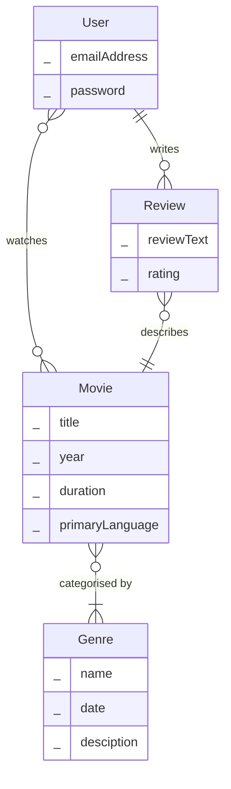
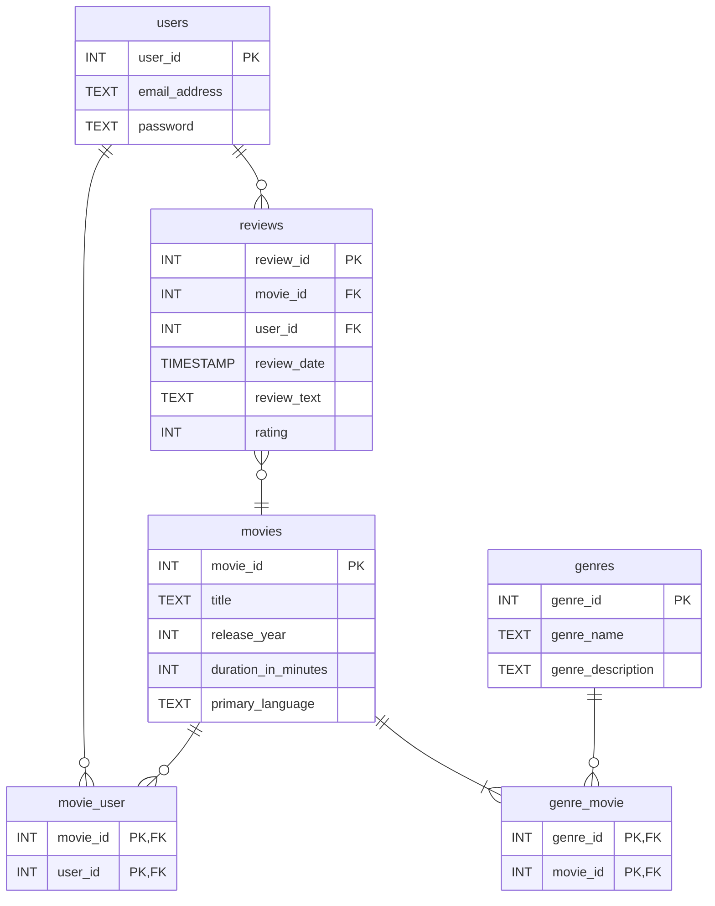
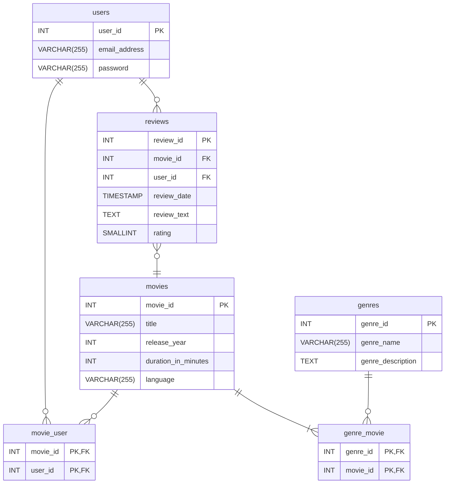

- strong and weak entities
- no single agreed upon method e.g. PKs on conceptual model
- It is an art not a science
- different diagramming tools - the diagrams will look slightly different each
- associative entities, relationship entities
- lists as tables

<!-- How can I tie in the key idea of integrity and consistency to this? -->

<!-- Conceptual: What does the business want to track? (Plain language).
Logical: How do we map this to relational tables? (Generic structure).
Physical: Exactly how does our chosen server process and store this data? (Code-ready instructions). -->

<!-- 
The first step involves identifying key stakeholders. For example, if we are building an e-commerce website we will need a database to store data about customers, products and orders. Here are some stakeholders:- -->

<!-- ## Introduction -->
# Introduction to Database Design

This week is about the design of databases, how we go about choosing the tables we need in a database, and what columns those tables need to feature.

From the start of the course we have been considering the design of our tables. For example, when choosing data types and constraints for our columns, when identifying relationships and using foreign keys. This week is a deeper look at database design, thinking about the process of database design from start to finish, and the techniques of database design.

Regardless of the database, there are some basic principles that we always want follow:-

1. Duplicate (redundant) data is bad.
  - Increases the chances of inconsistencies.
  - Wastes space.
2. The design should make sure the data is accurate and correct.

We want to design the database in a way so that we reduce redundant data and reduce the possibility for incorrect or inconsistent data.

## Database Design is an Art not a Science

When designing a database there is rarely a single, universally agreed on perfect design. 

There are certainly badly designed databases where we can point to obvious problems and design flaws. There are scientific approaches we can take such as normalisation (that we will look at later in the course) that can help us improve designs. However, especially when building more complex databases, the design choices we make often involve compromise and there can be different ways of solving a particular design problem. 

## The Relational Database Design Process

A widely used design process involves the following steps:

1. Requirements Gathering
2. Conceptual Design
3. Logical Design
4. Physical Design and Implementation

## Requirements Gathering

The first step is to determine the purpose of the database. It involves finding answers to questions such as:-
- Who is the database for? 
- How are they going to use it? 
- What data do we need to store? 

This first step involves identifying key **stakeholders**. A **stakeholder** is any individual or group that has a direct interest in, will interact with, or is affected by the database system. 

For example, imagine we have been asked to design a database for a company called 'My Movie Diary'. They want to build a website where users can find their next movie to watch, write reviews, and keep a record of the movies they have watched. Here are some of the potential stakeholders:

- **Data Providers**: People who input data into the system (e.g., content administrators who add details for new movies, or everyday users updating their profiles and submitting reviews).
- **Data Consumers**: People who view reports or use the data to make decisions (e.g., the marketing team tracking the most popular movies to target advertisements).
- **Technical Staff**: People who build, optimize, and maintain the database (e.g., software developers and database administrators).

Requirements gathering typically involves interviewing stakeholders to find out their requirements for the database. Alongside this, there are other ways of gathering requirements. For example, analysing existing databases to understand the type of data that is stored and used by an organisation.

We can use the responses from requirements gathering interviews to specify data requirements e.g.
- _'A key aspect of the site will be providing detailed data about movies. For each movie, we need to present the title, duration, year of release, and main language. We also want to categorise movies by genre making is easy for users to find similar movies.'_
- _'Users will need to register with an email address and login using a password to access the site. They need to be able to search the website for movies in different ways e.g. by title, genre etc'_ 
- _'As a user it's really important that I can record when I've watched a movie so I can keep track of all the movies I've watched.'_ 
- _'We want to emphasise user generated content. This will add real value to the site. Users need to be able to write reviews of movies they've seen and give a rating out of five. These will be visible when other users view a movie's details.'_

We might also discover business rules e.g.
- _'A user will only be allowed submit one review per movie. They can edit it, but they can only have one review per movie'_
- _'A rating must be a whole number between 1 and 5'_

There maybe non-functional requirements e.g.
- Performance (how fast queries need to run) - _'We need to store the details of over 1 million movies. We anticipate over 10 million users.'_
- Security (who can access parts of the site) - _'Only content administrators can add new movies'_

## Conceptual Model

Based on the requirements gathering, the next step is to build a conceptual model. The purpose of the conceptual model is to record an understanding of what data we need to store in our database. It involves identifying entities, attributes of entities and the relationships between entities. 

<!-- The purpose of the conceptual model is to create a shared understanding of what data we need to store in our database. -->

We capture this using an entity relationship diagram, an ERD

The first step of building our conceptual model involves identifying **entities** we want to store data about. An entity is a type of thing from the real world. Entities can have a physical 'real' existence e.g. a user, a product or a movie, or a purely conceptual existence e.g. a wishlist or a booking.  

We identify entities by looking for **common nouns** in our requirements specification. What is a common noun? A common noun is a noun that describes a type of object or thing i.e. identifies an entity. We can view a common noun as being a template for describing proper nouns (instances of objects).

To make this clear, here are some examples:

|Common Noun  |Proper Noun       |
|-------------|------------------|
|Footballer   | Lionel Messi     |
|Country      | France           |
|Movie        | Casablanca       |
|Employee     | Ananya Patel     |
|City         | London           |
|Language     | Spanish          |

Looking at the requirements for My Movie Dairy

- _'A key aspect of the site will be providing detailed data about **movies**. For each **movie**, we need to store the title, duration, year of release, and main language. We also want to categorise movies by **genre** making is easy for **users** to find similar movies.'_
- _'**Users** will need to register with an email address and login using a password to access the site. They need to be able to search the website for **movies** in different ways e.g. by title, **genre** etc'_ 
- _'As a **user** it's really important that I can record when I've watched a **movie** so I can keep track of all the **movies** I've watched.'_ 
- _'We want to emphasise **user** generated content. **Users** need to be able to write **reviews** of movies they've seen and give a rating out of five. These will be visible when other **users** view a **movie**'s details.'_

I have identified the following entities:-
- User
- Movie
- Genre
- Review

Again based on the requirements, I have assigned attributes to entities

- User
    - email Address
    - password
- Movie
    - title
    - year
    - duration
    - language
- Genre
    - name
    - description
- Review
    - reviewText
    - rating

Why haven't I identified email address or language as entities? These are types of things. We have to make a judgement. At this stage I think email address and password are likely to be attributes of User. I think language is going to be an attribute of Movie. I may be proved wrong, in which case I can review the diagram, but for now I'll leave them out of my list of entities.

When we describe entities we use singular i.e. **User** not **Users**. We capitalise the first letter, and we use **CamelCase** for multi-word terms e.g. ChairForRent. Next, we need to start thinking about the relationships between entities.

Identifying relationships:
- A user **_watches_** a movie
- A user **_writes_** a review
- A review **_describes_** a movie
- A movie is **_categorised_** under a number of genres

Assigning cardinality:
- There is a M:M relationship between User and Movie. A user can watch **many** movies. A movie can be watched by **many** users
- There is a 1:M relationship between User and Review. A user can write **many** reviews. A review is written by **one** user.
- There is a 1:M relationship between Movie and Review. A movie can have **many** reviews. A review describes **one** movie. 
- There is a M:M relationship between Genre and Movie. A movie can be categorised under **many** genres. A genre is used as a category for **many** movies

We can put these on an Entity Relationship Diagram (ERD)

- I have also added optionality. For example, a movie must have at least one genre, when a user first registers they won't have any reviews and won't have watched any movies.

Alongside the ERD we also produce a data dictionary. A data dictionary, usually presented as set of tables, records information about entities and attributes that isn't easy to represent on an ERD.

<!-- Sometimes we call this metadata -->

We produce an entity index table that lists the entities. Then, for each entity, we produce a separate table that describes the attributes of that entity. Here's an example entity index table.

**Entities**
|Entity Name|Description                                                                     |
|-----------|--------------------------------------------------------------------------------|
|User       |An individual registered on the site who rates, reviews, or logs watched films. |
|Movie      |A specific movie or film available on the site.                                  |
|Genre      |A category for a movie (e.g drama, romance).                                     |
|Review     |A user provided review of a specific movie.                                      |

And an example attributes table

**Review**
|Attribute Name|Description                                                |Data Type|Required    |Validation                                              |Other                        |
|-----------|-------------------------------------------------------------|----------|------------|--------------------------------------------------------|-----------------------------|
|reviewText |A user's review of a movie                                   |Text      |   No       |Users don't have to provide a text review. If they do, it must be at least 100 characters in length.  |May contain basic HTML tags  |
|date       |The date the review was submitted or updated                 |Date      |   Yes      |Cannot be a future date                                 |-                            |
|rating     |A numeric rating for the movie                               |Number    |   Yes      |An integer between 1 and 5                              |               -             |

Together the conceptual ERD and data dictionary make our conceptual model. The key thing about the conceptual model is that is contains **nothing technical or database related**. There isn't any mention of primary keys, foreign keys, or specific database data types. We are simply trying to capture the real world entities, their attributes, and the relationships between entities. 

We show the conceptual model to our business stakeholders to check we have covered all the requirements, and built a shared understanding of the data we need to store. Because there isn't anything technical in the conceptual model, it should be easy for everyone to understand and comment on. We may need to go through several iterations of a conceptual model as we get feedback from stakeholders and clarify requirements. 

> If we think back to the exercise on identifying the cardinality of relationships last week a number of the examples were ambiguous e.g. football team and manager. From the brief text description it wasn't completely clear how the relationship should be modelled. This example should give you some idea why requirements gathering and dialogue with stakeholders is so important. They can clarify exactly what data needs to be stored and how it will be used.  

## Logical Model

The logical model is where we start thinking about how the conceptual model can be mapped to a relational database design. Entities we identified during conceptual modelling will become tables in our database, and their attributes will become columns. 

Here's the logical model for the My Movie Diary example.

## Example Logical Model

We can view the resulting logical model as being a generic specification for a relational database; it could be used a plan for implementing a database in any RDBMS, SQLServer, Oracle, PostgreSQL etc. 

Creating the logical model involves the following steps:

- Name tables and columns.
- Identify or add primary key columns.
- Resolve M:M relationships using junction tables. 
- Specify relational database data types.

<!-- 
We add table names, primary keys, foreign keys, resolve M:M relationships using junction tables, and at a high level specify data types for fields. We specify contraints e.g. rating must be 1-5, but in natural language not as specifci database syntax. -->

The following describes some key 

### Naming tables and columns

We should use the conventions introduced in the first week of the course e.g. name tables and columns in lower case, give tables plural names, give columns singular names etc.

When we work with databases that contain many tables it can become difficult to keep track of and remember the purpose of every single column. This is especially true when writing complex joins that may feature many tables.  For this reason, we should give careful thought to the naming of columns. The general advice is to be as descriptive and clear as possible without making the name too long. 

Here are some examples for the _movies_ table. 

The _release_year_ column. 
- _year_ Not clear enough, is this the year the movie was made, the year it was released?
- _year_movie_was_released_ Too long and wordy, it becomes tedious to type. 
- _release_year_ A good middle ground? Clear and descriptive, not too long.

The _duration_in_minutes_.
- _duration_ Not clear enough, is this duration in seconds? minutes? hours?
- _duration_of_movie_in_minutes_ Too long and wordy, it becomes tedious to type. 
- _duration_in_minutes_ A good middle ground? Clear and descriptive, not too long.

<!-- In the _genres_ table, I have named the 'name' column _genre_name_.  -->

<!-- There is opportunity to use an example here. The space landing where they mixed up different units of pressure and it crashed.  -->

## Selecting Primary Keys
For each table we need to identify a primary key column or columns. Initially we should look for natural keys i.e. an attribute that exists in the real world. Every primary key must strictly follow these rules:

- **Unique**: No two rows can have the same value.
- **Static**: The value will never change over time.
- **Mandatory**: The value can never be null or empty.

We should be familiar with the idea of primary keys from previous weeks. Looking at the logical ERD, you might question why _email_address_ hasn't been used as the primary key. Although email addresses are unique, at some point in the future, a user might want to change the email address associated with their account. This would break the static rule. For this reason, I have opted for a surrogate key. 

### Composite Keys vs Surrogate Keys
The reviews table has a surrogate key (review_id). I could have used a composite primary key (_movie_id_, _user_id_) as this would uniquely identify each row and constrain users to only having one review per movie.

The surrogate key offers a number of advantages. At some point I might want to use the primary key as a foreign key. For example, if we add functionality for other users to 'like' a review, we would use the primary key of the _reviews_ table as a foreign key in this _likes_ table. Using a single _review_id_ value is much easier to manage than using both _movie_id and _user_id_ in the child table. 

Database operations such as sorting and joining run significantly faster using a simple integer primary key rather than a multi-column surrogate key. 

### Resolve Many-to-Many Relationships
The conceptual model features many-to-many relationships. Like we saw previously, to implement these in a relational database we need a junction table. See _movie_genre_ and _movie_user_ in the logical ERD. These follow exactly the same structure as these example we looked at last week. 

### Specify Relation Database Data Types
In the conceptual model, we described data types at a high level that stakeholders could understand. We can now specify suitable relational database types. However, because different RDBMSs use different data type specifications, we keep these definitions relatively broad at this stage.

### Update the Data Dictionary
We should create a new data dictionary. This captures additional information such as primary and foreign keys and database data types. 

**reviews**
|Column|Description                                         |Data Type |Key                                         |Nullable         |Validation                                 |Other                        |
|-----------|-----------------------------------------------|----------|--------------------------------------------|-----------------|-------------------------------------------|-----------------------------|
|review_id  |Unique identifier for each movie review.       |INT       |PK                                          |   NOT NULL      | -                                         |Auto-incrementing            |
|movie_id  |The movie being reviewed                        |INT       |FK (reference movie_id in the movies table) |   NOT NULL      |Composite unique constraint with user_id   |  -                          |
|user_id  |The user that wrote the review                   |INT       |FK (references user_id in the users table)  |   NOT NULL      |Composite unique constraint with movie_id  |  -                          |
|review_text |A user's review of a movie                     |TEXT      | -                                          |   NULL          |If present, must be at least 100 characters|May contain basic HTML tags  |
|review_date   |The date the review was submitted or updated   |TIMESTAMP | -                                          |   NOT NULL      |Cannot be a future date                    |-                            |
|rating     |A numeric rating for the movie                 |INT       | -                                          |   NOT NULL      |An integer between 1 and 5                 |               -             |

## Physical Model

Finally, the physical model is a precise blueprint for implementing a database using a specific RDBMS, in our case PostgreSQL. At first glance it might look the same as the logical model. However, we can now select the precise data types for our database. For example, we specify `SMALLINT` for the _rating_ column. If we were using a different RDMS we may use different data type. For example, MySQL has a `TINYINT` data type that would be more appropriate than `SMALLINT`. Similarly, MySQL has a `DATETIME` data type that we could use instead of timestamp.  

Based on the physical model, we should be able to write exact SQL `CREATE` statements without any hesitation or ambiguity.  

Here's the physical model.

We would also update our data dictionary to document details not present in the ERD.

**reviews**
|Column|Description                                         |Data Type |Key                                         |Nullable         |Validation                                 |Other                        |
|-----------|-----------------------------------------------|----------|--------------------------------------------|-----------------|-------------------------------------------|-----------------------------|
|review_id  |Unique identifier for each movie review.       |INT       |PK                                          |   NOT NULL      | -                                         |GENERATED ALWAYS AS IDENTITY |
|movie_id  |The movie being reviewed                        |INT       |FK (reference movie_id in the movies table) |   NOT NULL      |Composite unique constraint with user_id   |  -                          |
|user_id  |The user that wrote the review                   |INT       |FK (references user_id in the users table)  |   NOT NULL      |Composite unique constraint with movie_id  |  -                          |
|review_text |A user's review of a movie                     |TEXT      | -                                          |   NULL         |CHECK (length(review_text) >= 100)|May contain basic HTML tags  |
|review_date       |The date the review was submitted or updated   |TIMESTAMP | -                                          |   NOT NULL      |CHECK (review_date <= CURRENT_TIMESTAMP)                   |-                            |
|rating     |A numeric rating for the movie                 |SMALLINT       | -                                          |   NOT NULL |CHECK (rating BETWEEN 1 AND 5)           |  DEFAULT CURRENT_TIMESTAMP                          |

## Using Look Up Tables

In the hotel finder application we needed to store the category of hotel (boutique, business, budget, luxury). It made sense to specify this as an attribute of the hotel table.

The problem here is that when we have a restrcted list of values such as this we are going to end up with lots duplication in our database.

This causes problems as everytime an administrator enters the details of a new hotel we are rleying on them to enter the style of hotel in exactly the same way each time. Obviously human error is going to come into play and we might end up with boutique being entered as bouteek, bootique, Boutique etc.

For this reason whenever we have a restricted list of possible values we should always create a separate table and use a foreign key to specify which value to use.

Sometimes this is called an enumeration.

You may think that we have removed the duplicate hotel styles and simply replaced it with duplicate id numbers instead.

However, this is much better as we have referential integrity if we try and insert a new hotel and don't use a valid id from the styles table postgres will throw an error, and we have data consistency as we only ever enter the style once.

What is more this design is more flexible for example if we wanted to provide a brief explanation of what we mean by a boutique hotel.

- can use CHECK constraints - simpler, but less flexible.

## associative entities (Relationships as Entities)

What are the relationships between these entities
Recipe - Ingredient
Student - Assignment
Customer - Flight

Product - Order

They are all M:M relationships. For example, A product can be part of many different orders, and an order can feature many different products.

Draw a line between your two Many-to-Many entities. If you can point to that line and ask the question 'How much?', 'When?', 'Where?', or 'How much did it cost?', then that line is secretly a table in disguise.

In all these examples there is probably going to be some additional data we need to store as part of the relationship. For example,

Go back to the Movie Diary example and add data to the user_movie relationship.

I want to record when the user has viewed the film so I make the user_movie relationship a viewings relationship.

I could have a composite PK movie_id, user_id, watched_at and use a timestamp.

TIMESTAMPTZ DEFAULT CURRENT_TIMESTAMP (postgress converts to users local timezone)

This could be a three-way PK, but probably better just to use a surrogate key

## Histrocial data

What is the relationship between?
Oscar - Movie

An oscar e.g. best picture is currently held by one movie. At this point in time there is only one movie that is best picture. A movie can be awarded many different oscars, but at this moment in time only one.

1:1, 1:M, M:M?

Needs to be clarified with stakeholders, more requirments gathering.

## n-ary relationships

Character/Role - Handles Voice Actors / Body Doubles: It easily shows how James Earl Jones (voice) and David Prowse (body) can both be linked to Darth Vader in the exact same movie.

Real Estate: Property Viewings (Agent ➔ Buyer ➔ Property)In a real estate agency, multiple agents show multiple listed houses to various potential buyers. Tracking these viewings is critical for calculating commission and feedback loop statistics.

Multiplayer Video Games: Match Statistics (Player ➔ Character ➔ Match)In competitive video games (like League of Legends, Overwatch, or Super Smash Bros.), players choose from a roster of heroes or champions for a specific round or tournament game.

- Need consistent terminology
- Text should only be entered once
- Don't store values that should be calculated
  - How about grades A, B, C etc. and marks

- Go back to previous slides
  - Where to put historical
  - Extra info in a junciton table e.g. ingredients
  - Ternay relationships

## self relationships

## inheritance relationships

Scenario 1: The Gym Membership Tracker (5 Tables)This is an excellent scenario for teaching many-to-many relationships using something students understand.The Story: A local gym wants to track its members, the fitness classes they offer (like Yoga or Spin), and which members attend which classes.Why it works: Students instantly understand that a member can take many classes, and a class can have many members, making the introduction of a junction table highly logical.The Tables (approx. 5):MemberClassBooking (The junction table connecting Members to Classes)Trainer (Who teaches the class)Membership_Plan (e.g., Basic, Premium)

Scenario 3: The Independent Coffee Shop POS (6 Tables)An ideal scenario for introducing a sales transactional model without the massive scale of an Amazon-sized e-commerce site.The Story: A local coffee shop needs a system to track daily sales, menu items, and the staff members processing the orders.Why it works: It introduces the classic Order vs. Order_Item pattern, which is a fundamental milestone for any database student.The Tables (approx. 6):Product (Coffee, Pastries)Category (Drinks, Food)Employee (Baristas)Customer (Optional loyalty members)Order (The main receipt header: Date, Time, Total, Employee_ID)Order_Line_Item (The junction table tracking the exact quantity of each product per order)

Scenario 4: The School Board Game Club (4 Tables)The simplest possible scenario, great if you only have a single 60-minute session.The Story: An after-school board game club wants to track its inventory of games and who has borrowed them.Why it works: It is highly visual. Students can easily picture a shelf of games and a sign-out sheet.The Tables (approx. 4):StudentBoard_GameLoan_Record (Who borrowed what, when it went out, and when it came back)Publisher or Category (To demonstrate a simple lookup table)

Scenario 4: The Comic Book Collecting Tracker (3 Tables)This is the absolute simplest option. It is a pure cataloguing system with zero transactional history, making it perfect if you are very short on time.The Core Action: A hobbyist wants to log their personal collection of comic books and organize them by series and box location.The Tables (3):Publisher: The company making the comic (publisher_id, company_name — e.g., Marvel, DC, Image).Series: The title of the comic run (series_id, title, start_year, publisher_id).Comic_Issue: The specific physical book (issue_id, issue_number, condition, purchase_price, series_id).Why it works: There are no "users" or "members" in this database. It is entirely focused on a clean, linear chain of one-to-many relationships (Publisher ➔ Series ➔ Issue), which is ideal for teaching foreign key nesting.

I also like the community tools sharing app

Also use the flights

Also the marks example as it will be used wiht joins  

