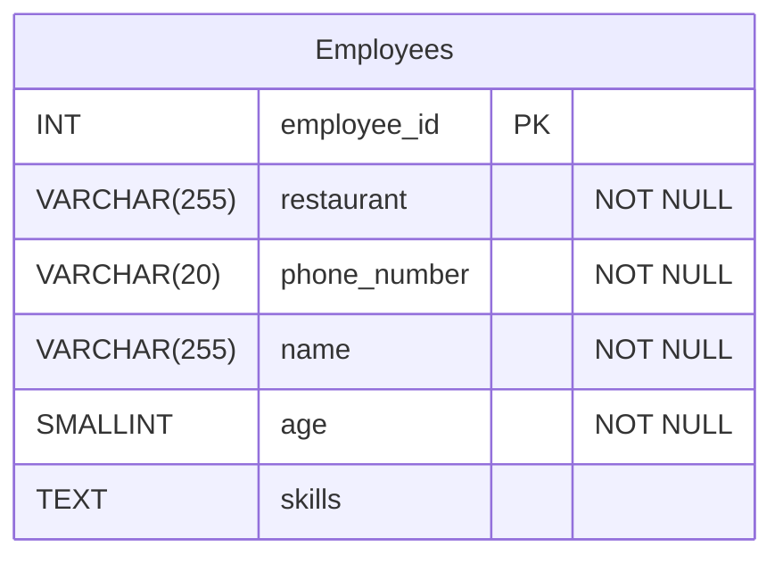

# A Badly Designed Database - The Happy Pizza Company

**Normalisation** is a series of checks we can perform on a relational database table to make sure we haven't broken basic design principles. 

To understand normalisation let's consider an example of a badly designed database. Then, at the end of this week, we will look at how normalisation can help fix some of these design flaws.

## The Happy Pizza Company

The Happy Pizza company own a number of pizza restaurants. They want a database to store information about their employees. They need to store basic information such as the employee name, and their key skills (making pizzas, delivering pizzas, taking orders etc.). They also need to know details about the restaurants where employees work; the name of the restaurant and the phone number. Because an employee's wage is dependent on how old they are, Happy Pizza also need to keep a record of employee ages.

An initial, single table database design has been implemented.

#### Physical ERD for the Happy Pizza Company 

Here's what the table looks like.

**employees**
| employee_id (PK) | restaurant     | phone_number   | name            | age | skills                              |
| :---------- | :------------- | :------------- | :-------------- | :-- | :---------------------------------- |
| 1           | London Central | 07712 990001 | Amara Diallo    | 22  | making pizzas, customer service     |
| 2           | Central London | 07712 990001 | Alice Smith     | 18  | delivery                            |
| 3           | Manchester     | 07712 990003 | Mateo Rodríguez | 25  | making pizzas, delivery, shop management |
| 4           | Manchester     | 07712 990003 | Diana Prince    | 19  | customer service                    |
| 5           | London Central | 07712 990001 | Fatima Al-Sayed | 31  | making pizzas                       |
| 6           | Birmingham     | 07712 990005 | Dan Ramsay      | 25  | customer service, making pizzas, shop management              |


There are a number of issues with the design of this database that will lead to **anomalies**. _An anomaly is a database action that may lead to data inconsistency or accidental data loss_. 

### Update Anomaly

The company need to change the phone number for the 'London Central' restaurant. We might run a query such as:

```sql
UPDATE employees
SET restaurant_phone_number = '07712 990002'
WHERE restaurant = 'London Central';
```
Row ID=2 won't get updated as the restaurant name has been entered incorrectly as 'Central London' not 'London Central'.

### Insertion Anomaly
The company are opening a new branch in Leeds. We write some SQL to insert the details of the new restaurant. 

```sql
INSERT INTO employees (restaurant, phone_number, name , age, skills )
    VALUES ('Leeds','07712 990006',NULL,NULL,NULL);
```
This `INSERT` statement would generate an error. We have declared `name` and `age` to be `NOT NULL`. This makes sense, we need to store these details for every employee. However, we need to create the new branch before we can add employees. In the current database design this isn't possible. 

### Deletion Anomaly
Dan Ramsay leaves the company. We need to remove their details from the database.

```sql
DELETE FROM employees WHERE employee_id = 6;
```
If we delete row 6, this will also delete the details of the Birmingham restaurant! This is the only row where these details are stored.

### Multi-Valued Columns
The `skills` column contains multiple values in each field. This creates lots of issues:- 
- It becomes difficult to query and filter using this column; we can't use a simple `WHERE skills='customer service'`. We'd have to use `LIKE` or `ILIKE`. 
- It becomes difficult to perform aggregations. For example, we might want to know how many employees in the Manchester branch can make pizza. We can't use a simple `COUNT`. Instead, we'd have to do complex string splitting or extract the data and process it in code.

Multi-values columns also lead to update anomalies. For example, if Diane Prince passes their driving test, we might want to add 'delivering pizzas' to their list of skills.

```sql
UPDATE employees
SET skills = 'delivering pizzas'
WHERE employee_id = 4;
```

There are two problems here. First, this query would overwrite Diane's 'customer service' skill. Second, 'delivering pizzas' is different to the existing naming we have used for this skill, 'delivery', leading to more inconsistencies. 

### Storing Data That Should Be Calculated
Employee ages have been stored as an `INT`. In a year's time this data will be inaccurate. At the moment, the only way to maintain the accuracy of the data is to perform the tedious task of updating the database every time an employee has a birthday. 
