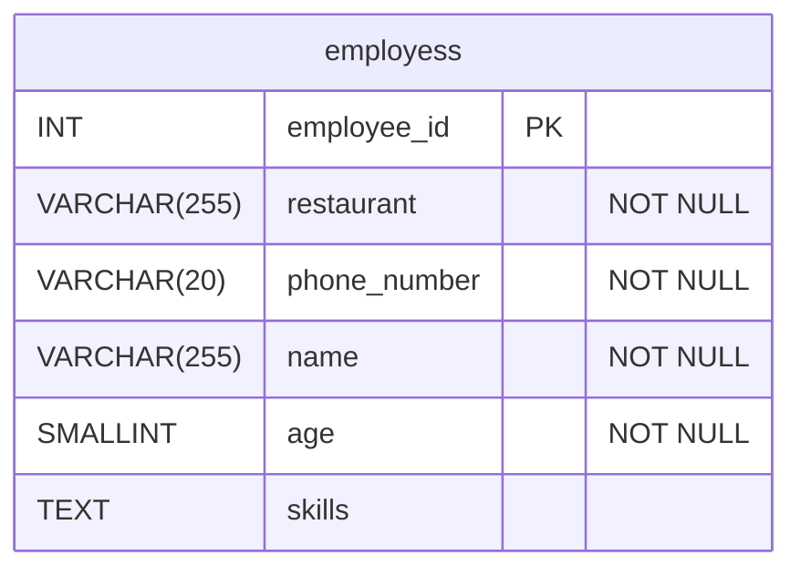
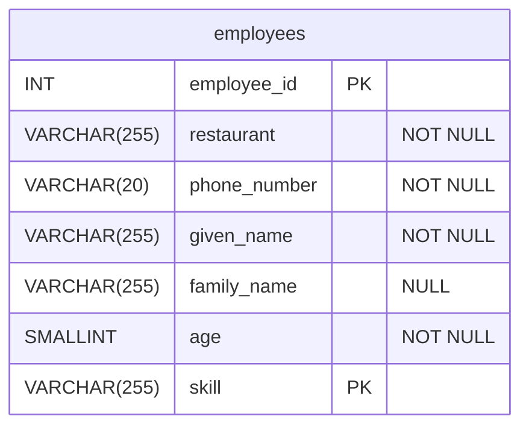
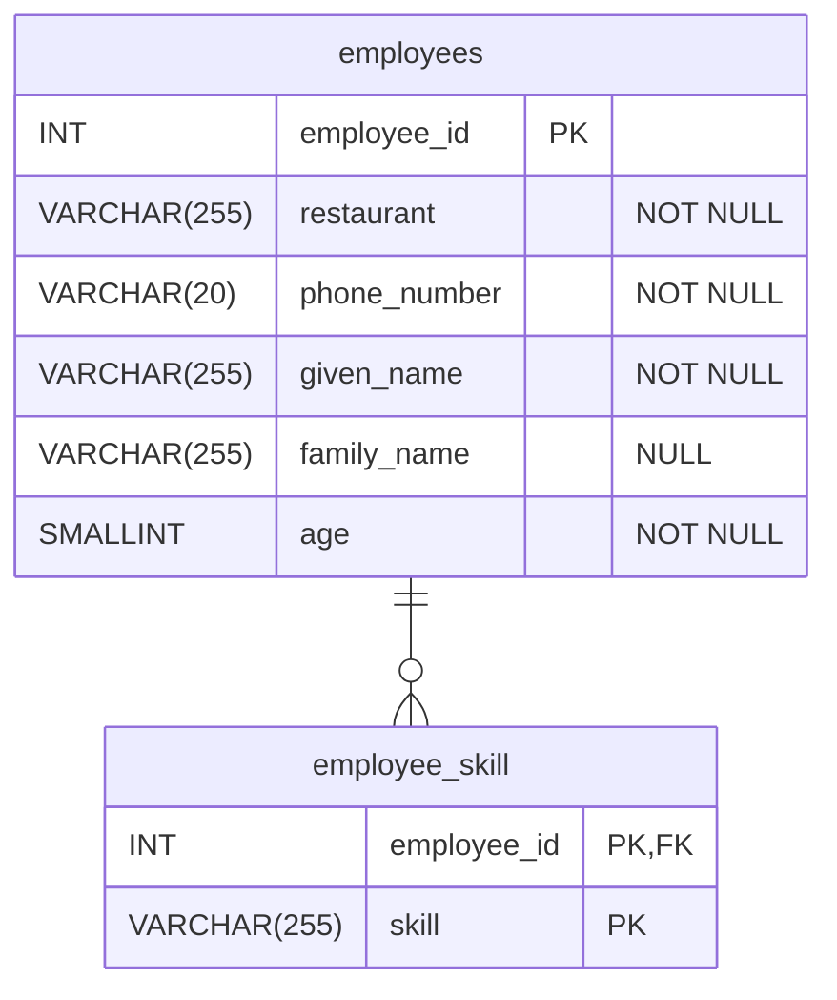
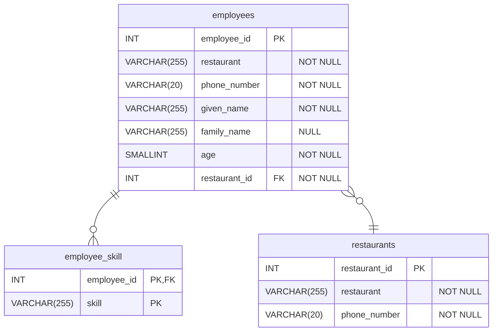

# Normalising the Happy Pizza Company Database
The following demonstrates how we can normalise the Happy Pizza Company to third normal form. 

## The Starting Point

Here's the original, badly designed database. 

**employees**
| employee_id (PK) | restaurant     | phone_number   | name            | age | skills                              |
| :---------- | :------------- | :------------- | :-------------- | :-- | :---------------------------------- |
| 1           | London Central | 07712 990001 | Amara Diallo    | 22  | making pizzas, customer service     |
| 2           | Central London | 07712 990001 | Alice Smith     | 18  | delivery                            |
| 3           | Manchester     | 07712 990003 | Mateo Rodríguez | 25  | making pizzas, delivery, shop management |
| 4           | Manchester     | 07712 990003 | Diana Prince    | 19  | customer service                    |
| 5           | London Central | 07712 990001 | Fatima Al-Sayed | 31  | making pizzas                       |
| 6           | Birmingham     | 07712 990005 | Dan Ramsay      | 25  | customer service, making pizzas, shop management              |

## First Normal Form (1NF)
Normalising to first normal form involves storing a single skill, instead of multiple skills. Each employee's details are now spread over multiple rows, a row for each skill. Therefore, `employee_id` can no longer be the primary key. We make the combination of `employee_id` and `skill` a composite primary key. 

I have also split the `name` column into separate `given_name` and `family_name` columns. 

**employees**
| employee_id (PK) | restaurant     | phone_number   | given_name      |family_name     | age | skill (PK)        |
| :----------------| :------------- | :------------- | :-------------- | :------------- | :---|------------------ |
| 1                | London Central | 07712 990001   | Amara           |Diallo          | 22  | making pizzas     |
| 1                | London Central | 07712 990001   | Amara           |Diallo          | 22  | customer service  |
| 2                | Central London | 07712 990001   | Alice           |Smith           | 18  | delivery          |
| 3                | Manchester     | 07712 990003   | Mateo           |Rodríguez       | 25  | making pizzas     |
| 3                | Manchester     | 07712 990003   | Mateo           |Rodríguez       | 25  | delivery          |
| 3                | Manchester     | 07712 990003   | Mateo           |Rodríguez       | 25  | shop management   |
| 4                | Manchester     | 07712 990003   | Diana           |Prince          | 19  | customer service  |
| 5                | London Central | 07712 990001   | Fatima          |Al-Sayed        | 31  | making pizzas     |
| 6                | Birmingham     | 07712 990005   | Dan             |Ramsay          | 25  | customer service  |
| 6                | Birmingham     | 07712 990005   | Dan             |Ramsay          | 25  | making pizzas     |
| 6                | Birmingham     | 07712 990005   | Dan             |Ramsay          | 25  | shop management   |

## Second Normal Form
Although the original table didn't contain a composite primary key, there is one now. Therefore, second normal form applies. 

No columns are dependent on both parts of the key. They are only dependent on part of the key, the (`employee_id`) bit. 

Normalising to second normal form gives us:

**employee_skill**
| employee_id (PK) | skill (PK)        |
| :----------------|------------------ |
| 1                | making pizzas     |
| 1                | customer service  |
| 2                | delivery          |
| 3                | making pizzas     |
| 3                | delivery          |
| 3                | shop management   |
| 4                | customer service  |
| 5                | making pizzas     |
| 6                | customer service  |
| 6                | making pizzas     |
| 6                | shop management   |

**employees**
| employee_id (PK) | restaurant     | phone_number   | given_name      |family_name     | age  |
| :----------------| :------------- | :------------- | :-------------- | :------------- | :--- |
| 1                | London Central | 07712 990001   | Amara           |Diallo          | 22   |
| 2                | Central London | 07712 990001   | Alice           |Smith           | 18   |
| 3                | Manchester     | 07712 990003   | Mateo           |Rodríguez       | 25   |
| 4                | Manchester     | 07712 990003   | Diana           |Prince          | 19   |
| 5                | London Central | 07712 990001   | Fatima          |Al-Sayed        | 31   |
| 6                | Birmingham     | 07712 990005   | Dan             |Ramsay          | 25   |

## Third Normal Form
There are transitive dependencies in the `employees` table. The `phone_number` is dependent on the `restaurant`, not the `employee_id`. If we remove this transitive dependency, by creating a separate `restaurants` table, the database is now in third normal form. 

This also fixes the incorrectly entered 'Central London' restaurant name for Alice Smith. 

**employees**
| employee_id (PK) | given_name      |family_name     | age |restaurant_id (FK)|
| :----------------| :-------------- | :------------- | :-- |:----------------|
| 1                | Amara           |Diallo          | 22  |1                |
| 2                | Alice           |Smith           | 18  |1                |
| 3                | Mateo           |Rodríguez       | 25  |2                |
| 4                | Diana           |Prince          | 19  |2                |
| 5                | Fatima          |Al-Sayed        | 31  |1                |
| 6                | Dan             |Ramsay          | 25  |3                |

**restaurants**
| restaurant_id (PK) | restaurant     | phone_number   | 
| :----------------| :------------- | :--------------|
| 1                | London Central | 07712 990001   |
| 2                | Manchester     | 07712 990003   |
| 3                | Birmingham     | 07712 990005   |

**employee_skill**
| employee_id (PK) | skill (PK)        |
| :----------------|------------------ |
| 1                | making pizzas     |
| 1                | customer service  |
| 2                | delivery          |
| 3                | making pizzas     |
| 3                | delivery          |
| 3                | shop management   |
| 4                | customer service  |
| 5                | making pizzas     |
| 6                | customer service  |
| 6                | making pizzas     |
| 6                | shop management   |

## Further Design Improvements
The database is now in third normal form. There are further design improvements we could make that aren't caught by normalisation. 
- Separating out the skills into a `skill` look-up table.
- Replacing employee ages with dates of birth. 

