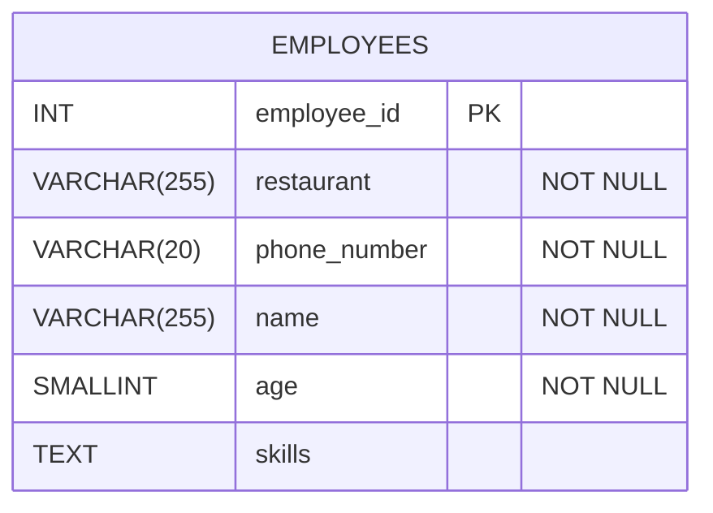

# Normalisation

**Normalisation** is a series of checks we can perform on a relational database table to make sure we haven't violated basic design principles. 

To understand normalisation let's consider an example of a badly designed database and then see how normalisation can help fix design issues. 
<!-- In the database design process, we would normalise once we have designed our tables i.e. after creating a logical database design.  -->

## A Badly Designed Database - The Happy Pizza Company

The Happy Pizza company own a number of pizza restaurants. They want a database to store information about their employees. They need to store basic information such as the employee name, and their key skills (making pizzas, delivering pizzas, taking orders etc.). They also need to know details about the restaurants employees work at e.g. name of the restaurant, phone number. Because an employee's wage is dependent on their age, Happy Pizza also need to keep a record of employees' ages.

An initial, single table database design has been implemented.

<!-- ```sql
CREATE TABLE employees (
    employee_id INT GENERATED ALWAYS AS IDENTITY PRIMARY KEY,
    restaurant VARCHAR(255) NOT NULL,
    phone_number VARCHAR(20) NOT NULL,
    name VARCHAR(255) NOT NULL,
    age SMALLINT NOT NULL,
    skills TEXT NOT NULL,
    constraint chk_age CHECK(age >=18),
);
``` -->


Here's what the table looks like.

**employees**
| employee_id (PK) | restaurant     | phone_number   | name            | age | skills                              |
| :---------- | :------------- | :------------- | :-------------- | :-- | :---------------------------------- |
| 1           | London Central | 07712 990001 | Amara Diallo    | 22  | making pizzas, customer service     |
| 2           | Central London | 07712 990001 | Alice Smith     | 18  | delivery                            |
| 3           | Manchester     | 07712 990003 | Mateo Rodríguez | 25  | making pizzas, delivery, management |
| 4           | Manchester     | 07712 990004 | Diana Prince    | 19  | customer service                    |
| 5           | London Central | 07712 990001 | Fatima Al-Sayed | 31  | making pizzas                       |
| 6           | Birmingham     | 07712 990005 | Dan Ramsay      | 25  | customer service, making pizzas, management              |


There are a number of issues with the design of this database that will lead to **anomalies**. _An anomaly is a database action that may lead to data inconsistency or accidental data loss_. 


### Update Anomaly

The company need to change the phone number for the 'London Central' restaurant. We might run a query such as:

```sql
UPDATE employees
SET phone_number = '07712 990002'
WHERE restaurant = 'London Central';
```
Row number two won't get updated as the restaurant has been entered incorrectly as 'Central London'.

### Insertion Anomaly

The company are opening a new branch in Leeds. We write some SQL to insert the details of the new restaurant. 

```sql
INSERT INTO employees (restaurant, phone_number, name , age, skills )
    VALUES ('Leeds','07712 990006',NULL,NULL,NULL);
```
This `INSERT` statement would generate an error. We have declared _name_ and _age_ to be `NOT NULL`. This makes sense, we need to want to store employee details. However, we need to create the new branch before we can add employees.

### Deletion Anomaly

Dan Ramsay leaves the company. We need to remove their details from the database.

```sql
DELETE FROM employees WHERE employee_id = 6;
```

If we delete row 6, this will also delete the details of the Birmingham restaurant. This is the only row where these details are stored.

### Multi-Valued Columns
The _skills_ column contains multiple values in each field. This creates lots of issues:- 
- It becomes difficult to query and filter using this column; we can't use a simple `WHERE skills='customer service'`.
- It becomes difficult to perform aggregations. For example, we might want to know how many employees in the Manchester branch can make pizza. We can't use a simple `COUNT`. Instead we'd have to do complex string splitting or extract the data and process it in code.

Multi-values columns also lead to update anomalies. For example, if Diane Prince passes their driving test, we might want to add 'delivering pizzas' to their list of skills.

```sql
UPDATE employees
SET skills = 'delivering pizzas'
WHERE employee_id = 4;
```

There are two problems here. First, this query would overwrite the Diane's 'customer service' skill. Second, 'delivering pizzas' is different to the existing naming we have used for this skill i.e. 'delivery', leading to more inconsistencies. 

### Storing Data That Should Be Calculated

Employee ages have been stored as an `INT`. In a year's time this data will be inaccurate. Instead, we should store date of birth and calculate the age. 

Not all these problems can be fixed by normalisation, but it can help address many of these problems. 

## Normalisation

To identify problems in the design of a database we use a process of **normalisation**. Normalisation involves making basic checks on a table. 
- These checks are called **normal forms** (NFs). 
- If our database table fails one of these checks the solution usually involves creating a new table. 
- There are 10 normal forms. We only need to be aware of the first three normal forms. These fix nearly all insertion, deletion and update anomalies.

## First Normal Form

First Normal Form states _'Each field should contain an atomic value'_. 
- An atomic value is a value that cannot be broken down into smaller, meaningful parts. 

Let's look at some tables that violate first normal form (1NF)

**musicians**
| musician_id (PK) | given_name | family_name |instruments              |
| :---------- | :--------- | :-----------|:------------------------|
| 1           | Alex       | Mercer      |Drums                    |
| 2           | Elena      | Kowalski    |Violin                   |
| 3           | Marcus     | Vance       |Drums, Keyboard          |
| 4           | Chloe      | Tanaka      |Keyboard                 |
| 5           | Zubair     | Ali         |Violin, Drums, Keyboard  |

This _musicians_ table is not in first normal form. The instruments field contains multiple values. The _instruments_ value e.g. 'Drums, Keyboard' could be broken down into smaller parts i.e. 'Drums' and separately 'Keyboard'.

The simplest fix is to store a single value in an  _instrument_ column and duplicate data in our database e.g.

| musician_id (PK) | given_name | family_name | instrument       |
| :--------------- | :--------- | :---------- | :----------------|
| 1                | Alex       | Mercer      | Drums            |
| 2                | Elena      | Kowalski    | Violin           |
| 3                | Marcus     | Vance       | Drums            |
| 3                | Marcus     | Vance       | Keyboard         |
| 4                | Chloe      | Tanaka      | Keyboard         |
| 5                | Zubair     | Ali         | Violin           |
| 5                | Zubair     | Ali         | Drums            |
| 5                | Zubair     | Ali         | Keyboard         |

This table is now in first normal form. We say the table has been normalised to first normal form. 

Of course this is going to give us huge problems with anomalies when this table gets used. Therefore, as we saw when we looked at relationships, the effective fix is to create a separate _instruments_ table and use a junction table to link musicians to instruments. 

**musicians**
| musician_id (PK) | given_name | family_name |
| :--- | :--- | :--- |
| 1 | Alex | Mercer |
| 2 | Elena | Kowalski |
| 3 | Marcus | Vance |
| 4 | Chloe | Tanaka |
| 5 | Zubair | Ali |

**instruments**
| instrument_id (PK) | instrument_name |
| :--- | :--- |
| 1 | Violin |
| 2 | Drums |
| 3 | Flute |
| 4 | Keyboard |

**musician_instrument**
| musician_id (PK) | instrument_id (PK) |
| :--- | :--- |
| 1 | 2 |
| 2 | 1 |
| 3 | 2 |
| 3 | 4 |
| 4 | 4 |
| 5 | 1 |
| 5 | 2 |
| 5 | 4 |


We might think we can fix the problem by creating separate columns for each instrument.

**musicians**
| musician_id (PK) | given_name | family_name |instrument1              |instrument1 |instrument3 |
| :---------- | :--------- | :-----------|:------------------------|------------|------------|
| 1           | Alex       | Mercer      |Drums                    | NULL           |NULL|
| 2           | Elena      | Kowalski    |Violin                   |NULL|  NULL         |
| 3           | Marcus     | Vance       |Drums                    |Keyboard    |NULL|
| 4           | Chloe      | Tanaka      |Keyboard                 |NULL|NULL|
| 5           | Zubair     | Ali         |Violin                   |Drums       | Keyboard  |

This is also a bad design. If we want to search for musicians that can play a particular instrument, which column should we search? If we need to add a new instrument for a musician how will we know which column to insert into?

## More First Normal Form Examples

First normal form is a bit more complex than it first appears. Consider the following table it keeps track sales events for a furniture shop. It records the discount percentage and the period the discount was offered. 

| sales_code (PK) | discount_percent  | sales_window             |
| :--------- | :-----------------| :------------------------|
| SUMMER26   | 5                 | 2026-08-14 to 2026-08-31 |
| WINTER26   | 10                | 2026-12-01 to 2027-02-28 |
| WINTER25   | 15                | 2025-12-07 to 2026-02-28 |

This table violates 1NF in two ways. First, the _sales_window_ column contains two pieces of data, the start and end date of the sale. This is not a single, atomic value. In this design it isn't easy to check if a sale was made during the sale period without extracting the _sales_window_ value and splitting it into separate dates. 

Second, the _sales_code_ also contains two pieces of data, the season e.g. SUMMER, and the year e.g. 26. If we want to search for all the discounts applied in a certain year we'd have to use a wildcard match e.g. `LIKE '%26'`.

After normalising to 1NF we split both these columns into two. Because _sales_code_ was my primary key, I've also added a surrogate key.

|sales_id (PK) | season     |year    |discount_percent  | sales_start              |sales_end              |
|:------   | :--------- |:------ |:-----------------| :------------------------|:------------------------|
|1         | SUMMER     |26      |5                 | 2026-08-14               |2026-08-31 |
|2         | WINTER     |26      |10                | 2026-12-01               |2027-02-28 |
|3         | WINTER     |25      |15                | 2025-12-07               |2026-02-28 |

It is also worth stating that atomicity is subjective and context-dependent. In this example, if the business never has to perform aggregations using the season or year, then the _sales_code_ column would work fine as the PK. A judgement has to be made based on the requirements of the business and future proofing the design.  

Finally, going back to The Happy Pizza company example. Applying first normal form gives us:

Do this example with a flattened table

**employees**

| employee_id (PK) | restaurant     | phone_number | name            | age |
| :---------- | :------------- | :----------- | :-------------- | :-- |
| 1           | London Central | 07712 990001 | Amara Diallo    | 22  |
| 2           | Central London | 07712 990001 | Alice Smith     | 18  |
| 3           | Manchester     | 07712 990003 | Mateo Rodríguez | 25  |
| 4           | Manchester     | 07712 990004 | Diana Prince    | 19  |
| 5           | London Central | 07712 990001 | Fatima Al-Sayed | 31  |
| 6           | Birmingham     | 07712 990005 | Dan Ramsay      | 25  |

**skills**

| skill_id (PK) | skill_name       |
| :------- | :--------------- |
| 101      | making pizzas    |
| 102      | customer service |
| 103      | delivery         |
| 104      | management       |

**employee_skill**

| employee_id (PK) | skill_id (PK)|
| :---------- | :------- |
| 1           | 101      |
| 1           | 102      |
| 2           | 103      |
| 3           | 101      |
| 3           | 103      |
| 3           | 104      |
| 4           | 102      |
| 5           | 101      |
| 6           | 102      |
| 6           | 101      |
| 6           | 104      |

The _employees_ table is now in 1NF.

<!-- 
1NF requires that every column contains atomic values (values that cannot be broken down any further into smaller, meaningful parts).

Atomicity is subjective and context-dependent. If your application only ever treats a name as a single, indivisible string—like printing a shipping label or displaying a welcome greeting—then a full name is atomic for your specific business logic.

Cultural Traps with "Strict" Splitting

Mononyms: Many people (especially in countries like Indonesia) legally have only one name (e.g., "Suharto"). Forcing a last_name column to be NOT NULL means these users cannot register.Name Order: In many East Asian cultures (e.g., China, Korea, Vietnam), the family name comes first.

For most standard business systems, the ideal balance for 1NF is to use two columns: given_name (what they go by) and family_name (their surname), while allowing the family name to be optional to accommodate mononyms.

### Addresses

The Problem with the "Single Field" Address. If you store a full address in one column, your database becomes incredibly difficult to use for business logic:No Regional Analysis: You cannot easily find all employees living in "London" or count how many workers live in a specific postcode.Terrible Formatting: Sorting by address will sort alphabetically by the house number first (e.g., all houses starting with "1" will group together).Search Inefficiency: You are forced to use slow text-matching queries (LIKE '%London%'), which can surface false positives (like an employee living on "London Road" in Manchester).

street_address city region_county postcode country is normal

The Address Normalization Trap While splitting addresses creates a clean 1NF design, going too far into Second and Third Normal Form (2NF/3NF) can overcomplicate things.Technically, a postcode determines the city and county. In a strictly normalized database, you might be tempted to move cities and postcodes to a separate lookup table so you don't repeat "London" and "Greater London" for every employee.Why developers rarely do this:International Chaos: Address formats vary wildly by country. The US uses "Zip Codes" and "States", the UK uses "Postcodes" and "Counties", and some countries don't use postcodes at all.Historical Accuracy: If an employee moves, or a city boundary changes, a highly normalized lookup table can accidentally alter historical data (like past tax or payroll records).Best Practice RecommendationKeep the address inside your employee or restaurant table, but split it into structural columns (Street, City, Region, Postcode, Country). This achieves 1NF atomicity without making your database layout impossible to manage internationally.Are you thinking about adding customer deliveries or calculating travel distances for your restaurants, which would require this kind of address breakdown?

## codes that contain multiple piece of info

2026-SPR
2026-AUT -->

## Second Normal Form
For a table to be in second normal form:
1. A table must be in first normal form.
2. All non-primary key columns must be functionally dependent on the whole of the primary key

Second normal form **only** applies if we have a composite primary key. Consider the following table that keeps track of courses students are taking, and the score they have obtained for the course. 

#### student_course_scores
|student_id (PK)| course_code (PK)| course_name                            | score|
|----------|-------------|-------------------------------------------------|------|
|1         | CFM7101     | Calculus                                        | 92   |
|1         | CFM7103     | Linear Algebra                                  | 88   |
|2         | CFM7101     | Calculus                                        | 78   |
|4         | CFM7101     | Calculus                                        | 71   |
|4         | CFM7103     | Linear Algebra                                  | 64   |
|6         | CIS7204     | Relational Database and Web Integration         | 85   |

**Functional dependency** means the value of one column completely determines the value of another column i.e. if we know the value of one column, we can look-up or predict the value of another column with absolute certainty.

Let's consider our non-primary key columns: _course_name_ and _score_.

Is _course_name_ dependent on the **whole** of the primary key? No. 
- If we know a _course_code_, we also know the _course_name_ e.g if the _course_code_ is 'CFM7101', the _course_name_ must to be 'Calculus'. _course_name_ is only dependent on part of the key. 

Is _score_ dependent on the **whole** of the primary key? Yes.
- If we only know a _course_code_ we can't be sure of the score. e.g. if we know the _course_code_ is CFM7103, the score could be 88 or it could be 64.
- If we only know a _student_id_ we can't be sure of the score. e.g. if we know the _student_id_ is 4, the score could be 71 or 64.
- If we know **both** the _course_code_ and the _student_id_ then we know the score e.g. if the _course_code is CFM7103 and _student_id_ is 4, then the score is 64. 

The fix is to split this into two tables

#### courses 

| course_code (PK) | course_name                             |
| :---------- | :-------------------------------------- |
| CFM7101     | Calculus                                |
| CFM7103     | Linear Algebra                          |
| CIS7204     | Relational Database and Web Integration |

#### student_course_scores

| student_id (PK) | course_code (PK)| scores |
| :--------- | :---------- | :--- |
| 1          | CFM7101     | 92   |
| 1          | CFM7103     | 88   |
| 2          | CFM7101     | 78   |
| 4          | CFM7101     | 71   |
| 4          | CFM7103     | 64   |
| 6          | CIS7204     | 85   |

The student_course_scores table is now in 2NF. We leave _score_ in the student_grade table as it is dependent on both parts of the composite key. 

Here's another example. Happy Pizza might want to keep track of items they have ordered from suppliers:-

| order_id (PK) | item_id (PK) | item_name  | quantity_kg |
| :------------ | :----------- | :--------- | :------- |
| 5001          | 101          | Mozzarella | 50    |
| 5001          | 102          | Pepperoni  | 20    |
| 5002          | 101          | Mozzarella | 30    |
| 5003          | 103          | Flour      | 100   |

This table isn't in second normal form. _item_name_ is only dependent on part of the key (_item_id_). Normalised to second normal form gives us: 

**items**

| item_id (PK) | item_name  |
| :------ | :--------- |
| 101     | Mozzarella |
| 102     | Pepperoni  |
| 103     | Flour      |

**order_items**

| order_id (PK) | item_id (PK) | quantity_kg |
| :------- | :------ | :---------- |
| 5001     | 101     | 50          |
| 5001     | 102     | 20          |
| 5002     | 101     | 30          |
| 5003     | 103     | 100         |

## Third Normal Form (3NF)

For a table to be in Third Normal Form:
1. The table must already be in Second Normal Form (2NF).
2. It must contain no **transitive dependencies**, all non-primary key columns must be independent of each other. 

In simple terms, every column should depend on the primary key, and *only* the primary key, not on another non-key column in the table. 

Consider the following table:

**products**
| product_id (PK) | product_name      | product_price | supplier_id     | supplier_name         |
| :-------------- | :---------------- | :------------ | :-------------- | :-------------------- |
| 1               | Widget            | 2.95          | 86              | Gearworks             |
| 2               | Gadget            | 1.86          | 45              | Smithson Engineers    |
| 3               | Gizmo             | 2.35          | 86              | Gearworks             |

The columns `product_name`, `product_price`, and `supplier_id` are all directly dependent on the primary key, `product_id`. They do not depend on each other. For example, if we know the price of a product, we do not automatically know the supplier because two different suppliers could sell products at the exact same price. 

However, `supplier_name` is dependent on `supplier_id`. If we know the `supplier_id`, it uniquely identifies the `supplier_name`. Because `product_id` determines `supplier_id`, which then determines `supplier_name`, we have a hidden chain of dependency (`product_id` $\rightarrow$ `supplier_id` $\rightarrow$ `supplier_name`).

An indicator that a table isn't in Third Normal Form is when the columns don't relate directly to the name of the table. The `supplier_name` column doesn't describe a *product*, it describes a *supplier*. 

Again, the solution to fix this issue is to split the data into separate tables and use a foreign key to link the rows together.

**suppliers**
| supplier_id (PK) | supplier_name      |
| :--------------- | :----------------- |
| 86               | Gearworks          |
| 45               | Smithson Engineers |

**products**
| product_id (PK) | product_name | product_price | supplier_id (FK) |
| :-------------- | :----------- | :------------ | :--------------- |
| 1               | Widget       | 2.95          | 86               |
| 2               | Gadget       | 1.86          | 45               |
| 3               | Gizmo        | 2.35          | 86               |

What about the Happy Pizza example? This table is in 2NF (no composite key). Is it in 3NF?

**employees**

| employee_id (PK) | restaurant     | phone_number | name            | age |
| :---------- | :------------- | :----------- | :-------------- | :-- |
| 1           | London Central | 07712 990001 | Amara Diallo    | 22  |
| 2           | Central London | 07712 990001 | Alice Smith     | 18  |
| 3           | Manchester     | 07712 990003 | Mateo Rodríguez | 25  |
| 4           | Manchester     | 07712 990004 | Diana Prince    | 19  |
| 5           | London Central | 07712 990001 | Fatima Al-Sayed | 31  |
| 6           | Birmingham     | 07712 990005 | Dan Ramsay      | 25  |

The answer is 'no'. _phone_number_ is dependent on _restaurant_. 

Normalising this table to 3NF gives us:


<!-- Again I could show an example without the id for restaurant.  -->
#### restaurants

| restaurant_id (PK) | restaurant_name | phone_number |
| :----------------- | :-------------- | :----------- |
| 1                 | London Central  | 07712 990001 |
| 2                 | Manchester      | 07712 990003 |
| 3                 | Birmingham      | 07712 990005 |

#### employees

| employee_id (PK) | name            | age | restaurant_id (FK) |
| :--------------- | :-------------- | :-- | :----------------- |
| 1                | Amara Diallo    | 22  | 1                 |
| 2                | Alice Smith     | 18  | 1                 |
| 3                | Mateo Rodríguez | 25  | 2                 |
| 4                | Diana Prince    | 19  | 2                 |
| 5                | Fatima Al-Sayed | 31  | 1                 |
| 6                | Dan Ramsay      | 25  | 3                 |

## Normalisation Doesn't Fix All Problems

Normalisation can fix many design issues that can lead to data anomalies. However, importantly, it doesn't fix all database design issues. Here are some issues that normalisation doesn't fix

- Redundant data. The following table is in 3NF but still features duplicate, redundant data (_restaurant_name_). The fix, which we have looked at previously, would be to use a look-up table for the _restaurant_name_.

| employee_id (PK) | name         | age | restaurant_name (FK) |
| :--------------- | :----------- | :-- | :-------------- |
| 1                | Amara Diallo | 22  | London Central  |
| 2                | Alice Smith  | 18  | London Central  |


| restaurant_name (PK)| phone_number |
| :------------------ | :----------- |
| London Central      | 07712 990001 |
| Manchester          | 07712 990003 |
| Birmingham          | 07712 990005 |

- Incorrect Data Types. For example, normalisation will not tell you that storing an age instead of a date of birth is a bad idea.

- Missing Constraints. Normalisation doesn't enforce business rules. For example, checking all employees are older than 18 (which requires a CHECK constraint).


 


<!-- 

tournaments

| tournament_id (PK) | player_id (PK) | registration_fee| player_name     | team_name  |
| :----------------- | :------------- | :---------------| :-------------- | :--------- |
| T100               | P44            | 50              | Marcus Rashford | Man United |
| T100               | P88            | 50              | Bukayo Saka     | Arsenal    |
| T200               | P44            | 120             | Marcus Rashford | Man United |
| T200               | P11            | 120             | Erling Haaland  | Man City   |

## Functional Dependencies

## Histroy tracking

The "History Tracking" Table (Markdown)

| employee_id (PK) | project_id (PK) | assignment_year | hourly_rate |
| :--------------- | :-------------- | :-------------- | :---------- |
| E101             | P77             | 2024            | £50         |
| E101             | P88             | 2025            | £65         |
| E102             | P77             | 2025            | £40         |
| E101             | P99             | 2026            | £80         |

How the Designer Falls into the 2NF Trap:The Flawed Analysis:

- The database designer looks at this table and says: "An employee has a set salary tier.
  -Therefore, hourly_rate depends solely on employee_id. That means we have a partial dependency, which violates 2NF!"The Wrong Action: To "fix" this supposed 2NF violation, they extract hourly_rate out of this table and move it into a standalone employees table:

We then lose the historical data

This is a similar example but cleaner

| professor_id (PK) | course_id (PK) | academic_year (PK) | term_name (PK) | textbook_budget |
| :---------------- | :------------- | :----------------- | :------------- | :-------------- |
| PROF_101          | CS_101         | 2025               | Autumn         | £500            |
| PROF_101          | CS_202         | 2026               | Spring         | £750            |
| PROF_102          | CS_101         | 2026               | Spring         | £450            |
| PROF_101          | CS_101         | 2026               | Autumn         | £550            |

## 3NF

| team_id (PK) | team_name   | sponsor_name | sponsor_email        |
| :----------- | :---------- | :----------- | :------------------- |
| T1           | Man United  | Adidas       | support@adidas.com   |
| T2           | Arsenal     | Emirates     | contact@emirates.com |
| T3           | Real Madrid | Emirates     | contact@emirates.com |
| T4           | Man City    | Puma         | info@puma.com        |

## Do it at the logical design phase of database design

Normalisation and database design go hand in hand.
Database design - we design tables based on user requirements
Normalisation - we use a quality check tool to fix any hidden flaws.

## Exercises

| tracking_id (PK) | ranger_id | ranger_contact           | animal_tag_details       | protection_status     | threat_level | funding_body        | sponsor_contact      |
| :--------------- | :-------- | :----------------------- | :----------------------- | :-------------------- | :----------- | :------------------ | :------------------- |
| LOG-2026-01      | R55       | Mara Camp, Radio Ch-4    | Black Rhino, Male        | Critically Endangered | Extreme      | World Wildlife Org  | conservation@wwo.org |
| LOG-2026-02      | R99       | Grumeti Base, Radio Ch-1 | African Elephant, Female | Endangered            | High         | EarthSave Trust     | info@earthsave.org   |
| LOG-2026-03      | R55       | Mara Camp, Radio Ch-4    | African Elephant, Male   | Endangered            | High         | EarthSave Trust     | info@earthsave.org   |
| LOG-2026-04      | R22       | Grumeti Base, Radio Ch-1 | Cheetah, Female          | Vulnerable            | Medium       | Panthera Initiative | grants@panthera.org  |

### Nice 1NF example

| order_id (PK) | item_id (PK) | item_name  | quantity |
| :------------ | :----------- | :--------- | :------- |
| 5001          | 101          | Mozzarella | 50 kg    |
| 5001          | 102          | Pepperoni  | 20 kg    |
| 5002          | 101          | Mozzarella | 30 kg    |
| 5003          | 103          | Flour      | 100 kg   |
| 5003          | 104          | Soft Drink | 12.00 litres    |

## Extra

Mention BCNF -->
