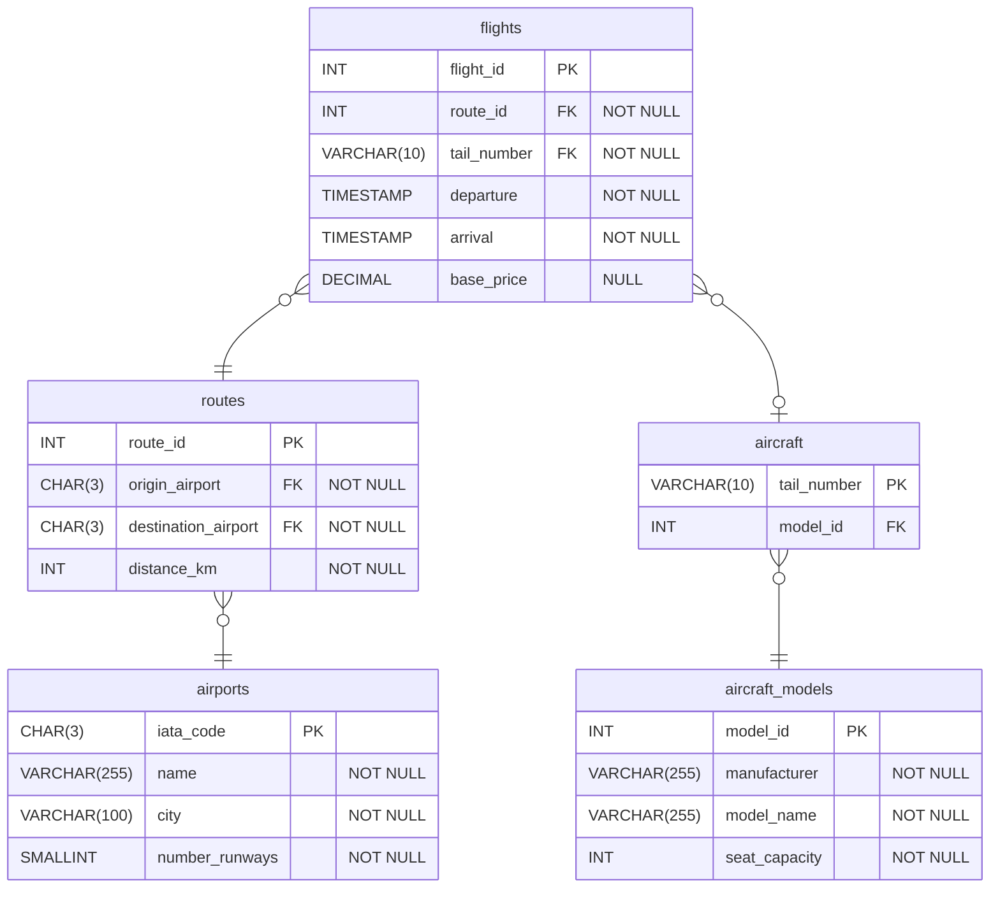

# SQL Subqueries
This lab is based on a flights scenario. An ERD for the database is shown below. 
- The database has already been set up and populated with sample data. Using the SQLTools extension, explore the database. Make sure you are familiar with the structure of the tables and you have viewed the data they contain. 
- Open _sql/flights_subqueries.sql_. Write SQL `SELECT` queries that answer each of the questions in the comments. 
    - Write your queries on a new line immediately after each question. 
    - Select your query and right-click to only run the selected query. 
    - Read the question carefully and make sure your query fully answers the question. 

