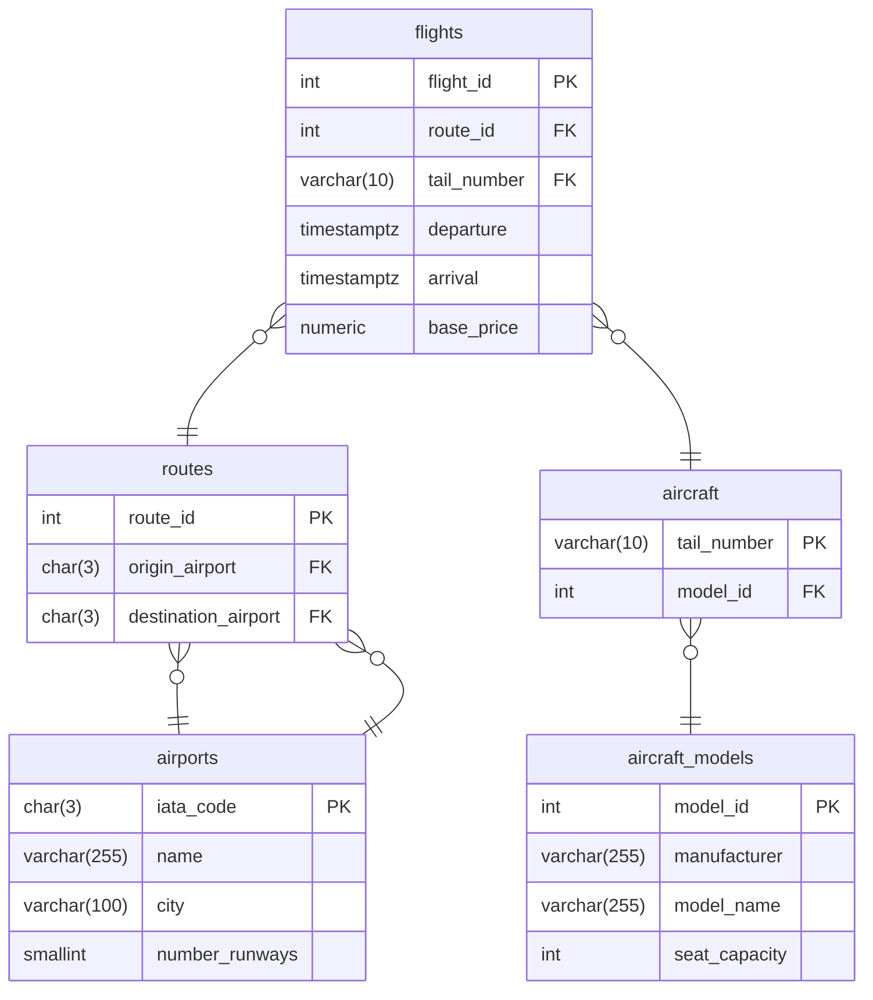

# SQL Subqueries
This lab is based on the following database.

- The database has already been set up and populated with sample data. Using the SQLTools extension, explore the `flights` database. Make sure you are familiar with the structure of the tables, and you have viewed the data they contain. 
- Open _movies_many_to_many_queries.sql_. Write SQL `SELECT` queries that answer each of the questions in the comments. 
    - Write your queries on a new line immediately after each question. 
    - Select your query and right-click to only run the selected query. 
    - Read the question carefully and make sure your query fully answers the question. 
    - The first question has been completed for you.