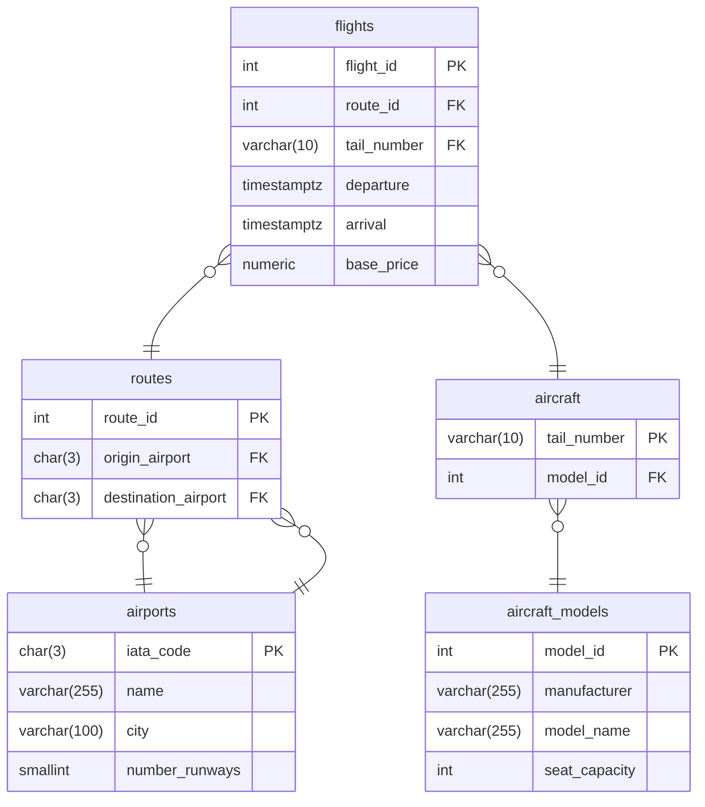

# Lab Outer Joins

## `LEFT OUTER JOIN`
Find all the aircraft that aren't booked for any flights

```sql
SELECT 
    a.tail_number,
    f.flight_id
FROM aircraft AS a
LEFT JOIN flights AS f ON a.tail_number = f.tail_number;
```
Modify the previous query to get the full details of the aircraft, the model_name and manufacturer

```sql
SELECT 
    m.manufacturer,
    m.model_name,
    a.tail_number
FROM aircraft_models AS m
INNER JOIN aircraft AS a ON m.model_id = a.model_id
LEFT JOIN flights AS f ON a.tail_number = f.tail_number
WHERE flight_id IS NULL;
```

Find all the airports that don't have any routes assigned to them.

```sql
SELECT 
    a.iata_code,
    a.name
FROM 
    airports AS a
LEFT JOIN 
    routes AS r ON a.iata_code = r.origin_airport
WHERE r.route_id IS NULL;
```

Find all the airports that don't have any flights scheduled to depart. 

```sql
SELECT 
    a.iata_code,
    a.name,
    r.route_id,
    f.flight_id
FROM 
    airports AS a
LEFT JOIN 
    routes AS r ON a.iata_code = r.origin_airport
LEFT JOIN
    flights AS f ON r.route_id = f.route_id
WHERE f.flight_id IS NULL;
```

## Inclusive Performance Reporting (Preserving Zero-Value Rows)

Produce a table of all airports and the total number of flights departing from the airport. 

```sql
SELECT 
    a.iata_code,
    a.name,
    COUNT(f.flight_id) AS num_flights
FROM 
    airports AS a
LEFT JOIN 
    routes AS r ON a.iata_code = r.origin_airport
LEFT JOIN
    flights AS f ON r.route_id = f.route_id
GROUP BY a.iata_code, a.name;
```

```sql
SELECT 
    a.iata_code,
    a.name,
    f.flight_id
FROM 
    airports AS a
LEFT JOIN 
    routes AS r ON a.iata_code = r.origin_airport
LEFT JOIN
    flights AS f ON r.route_id = f.route_id
```


## Using AND in the JOIN

Get the routes that have no flights scheduled on 2026-07-02. You can filter a timestamp e.g. '2026-07-02 00:00:00+00'

```sql
SELECT 
    *
FROM flights
WHERE flights.departure >= '2026-07-02 00:00:00+00' AND flights.departure < '2026-07-03 00:00:00+00';
```

```sql
SELECT 
    r.route_id,
    r.origin_airport,
    r.destination_airport,
    f.departure
FROM 
    routes AS r
LEFT JOIN 
    flights AS f 
    ON r.route_id = f.route_id
    AND f.departure >= '2026-07-02 00:00:00+00'
    AND f.departure < '2026-07-03 00:00:00+00'
WHERE 
    f.flight_id IS NULL;

```


<!-- 
Find the details of the aircraft model that has the highest seating capacity.

```sql
SELECT 
    manufacturer, 
    model_name, 
    seat_capacity
FROM aircraft_models
WHERE seat_capacity = (SELECT MAX(seat_capacity) FROM aircraft_models);
```

## Multiple row, Single Value Queries

Find all aircraft models that have never actually been assigned to a physical aircraft in the fleet.

```sql
SELECT manufacturer, model_name
FROM aircraft_models
WHERE model_id NOT IN (
    SELECT DISTINCT model_id 
    FROM aircraft
);
```

Find any scheduled flights that are flying from London Heathrow Airport.


```sql
SELECT flight_id, route_id, departure
FROM flights
WHERE route_id IN (
    -- Multi-column, single-row subquery
    SELECT route_id
    FROM routes
    WHERE routes.origin_airport = 'LHR'
);
```
## dervied tables

Find the average number of flights per route

```sql
SELECT AVG(route_tallies.total_flights) AS average_flights_per_route
FROM (
    SELECT route_id, COUNT(flight_id) AS total_flights
    FROM flights
    GROUP BY route_id
) AS route_tallies;

```


## Correlated Subqueries

Find all flights that are cheaper than the average price for their specific route.

```sql
SELECT f1.flight_id, f1.route_id, f1.base_price
FROM flights f1
WHERE f1.base_price < (
    SELECT AVG(f2.base_price)
    FROM flights f2
    WHERE f2.route_id = f1.route_id -- The correlation link
);

```
Contrast this with the simpler, non-correlated example you looked at earlier. A non-correlated subquery compares every flight to the global average (e.g., £300). This correlated version compares a London-to-New York flight only against other London-to-New York flights, and a short domestic flight only against domestic prices.

List all aircraft models, and show the total number of physical aircraft the airline owns for each model.

```sql
SELECT 
    am.manufacturer,
    am.model_name,
    (
        SELECT COUNT(*)
        FROM aircraft a
        WHERE a.model_id = am.model_id -- The correlation link
    ) AS total_owned
FROM aircraft_models am;

```


## Trickier Questions

maybe re-write the previous queries using CTEs or JOINs. 


maybe they use any approach they like for the trickier questions. 


Make sure you use a subquery

List the airport codes of any origins that have a higher average route distance than the specific average distance of routes originating from John F. Kennedy Airport (JFK).
```sql
SELECT origin_airport, ROUND(AVG(distance_km), 2) AS avg_origin_distance
FROM routes
GROUP BY origin_airport
HAVING AVG(distance_km) > (
    SELECT AVG(distance_km) 
    FROM routes 
    WHERE origin_airport = 'JFK'
);

```


Find the average number of runways across all cities in your database, some cities have multiple airports so you will need to sum these first.

```sql
SELECT AVG(city_runways.total_runways) AS average_runways_per_city
FROM (
    SELECT city, SUM(number_runways) AS total_runways
    FROM airports
    GROUP BY city
) AS city_runways; -- The mandatory alias

```


Find all flights that are departing from London. The subquery will need to find the route IDs of all routes that depart from London. 

```sql
SELECT r.origin_airport, r.destination_airport, f.flight_id, f.departure, f.arrival, f.base_price
FROM flights AS f INNER JOIN routes AS r ON f.route_id = r.route_id
WHERE f.route_id IN (
    SELECT route_id 
    FROM routes INNER JOIN airports ON routes.origin_airport = airports.iata_code
    WHERE airports.city = 'London'
);

```

For every individual route, you want to display the flight_id and departure timestamp for the single most expensive flight on that route.

```sql
SELECT 
    f.route_id,
    f.flight_id,
    f.departure,
    peak_prices.max_price
FROM flights f
-- Step 1: Isolate the highest price per route inside the derived table
JOIN (
    SELECT route_id, MAX(base_price) AS max_price
    FROM flights
    GROUP BY route_id
) AS peak_prices 
  ON f.route_id = peak_prices.route_id 
 AND f.base_price = peak_prices.max_price;

```




```mermaid
erDiagram
    routes }o--|| airports : origin
    routes }o--|| airports : destination
    flights }o--|| routes : route
    flights }o--|| aircraft_instances : assigned_plane
    aircraft }o--|| aircraft_models : model
    flight_crew_assignments }o--|| flights : flight
    flight_crew_assignments }o--|| crew : crew_member

    airports {
        char(3) iata_code PK
        varchar(255) name
        smallint number_runways
    }

    routes {
        int route_id PK
        char(3) origin_airport FK
        char(3) destination_airport FK
        varchar(10) flight_number
    }

    aircraft_models {
        int model_id PK
        varchar(50) manufacturer
        varchar(50) model_name
        int seat_capacity
    }

    aircraft {
        varchar(10) tail_number PK
        int model_id FK
        varchar(20) status
    }

    flights {
        int flight_id PK
        int route_id FK
        varchar(10) tail_number FK
        timestamptz departure
        timestamptz arrival
    }

    crew {
        int crew_id PK
        varchar(100) first_name
        varchar(100) last_name
        varchar(30) job_title
    }

    flight_crew_assignments {
        int flight_id PK, FK
        int crew_id PK, FK
        varchar(30) assigned_role
    }
``` -->