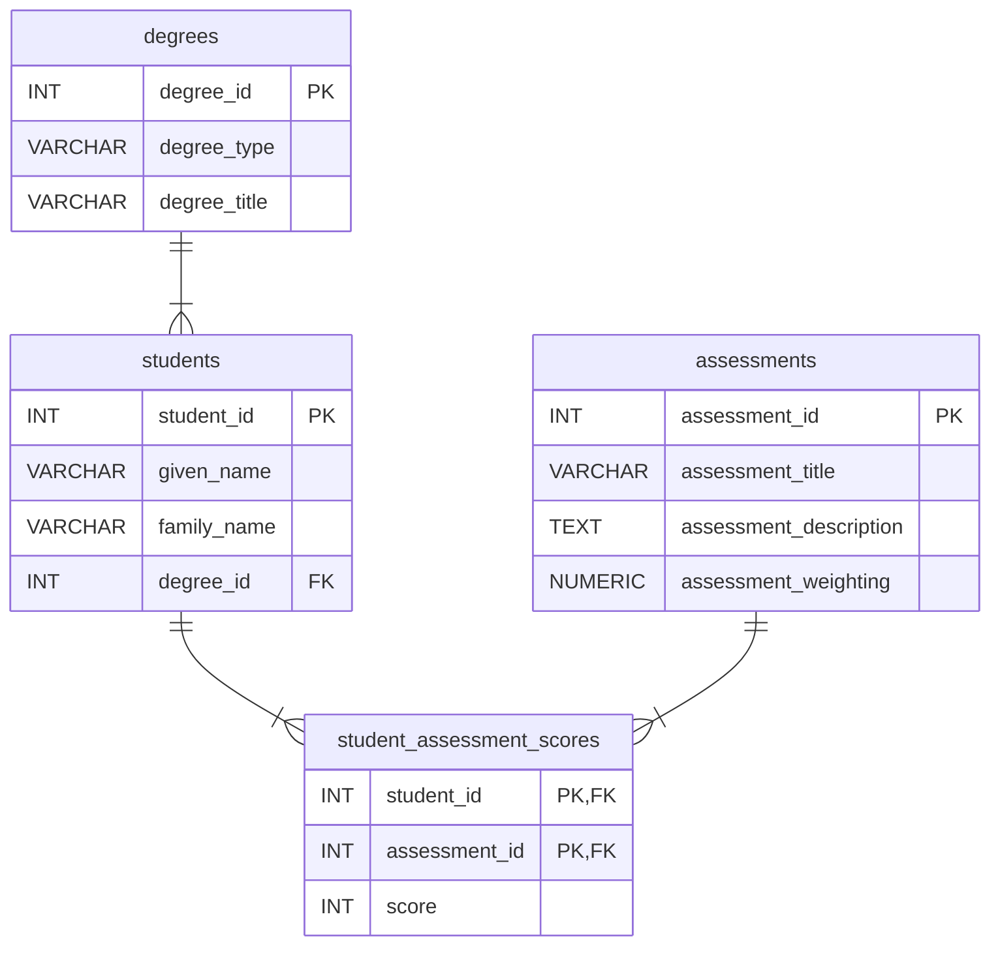
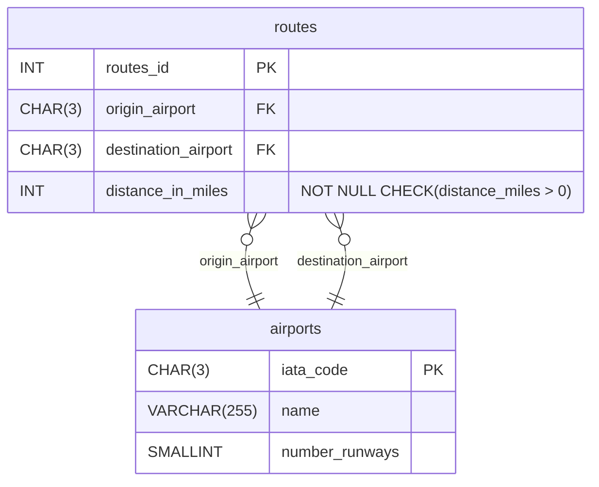
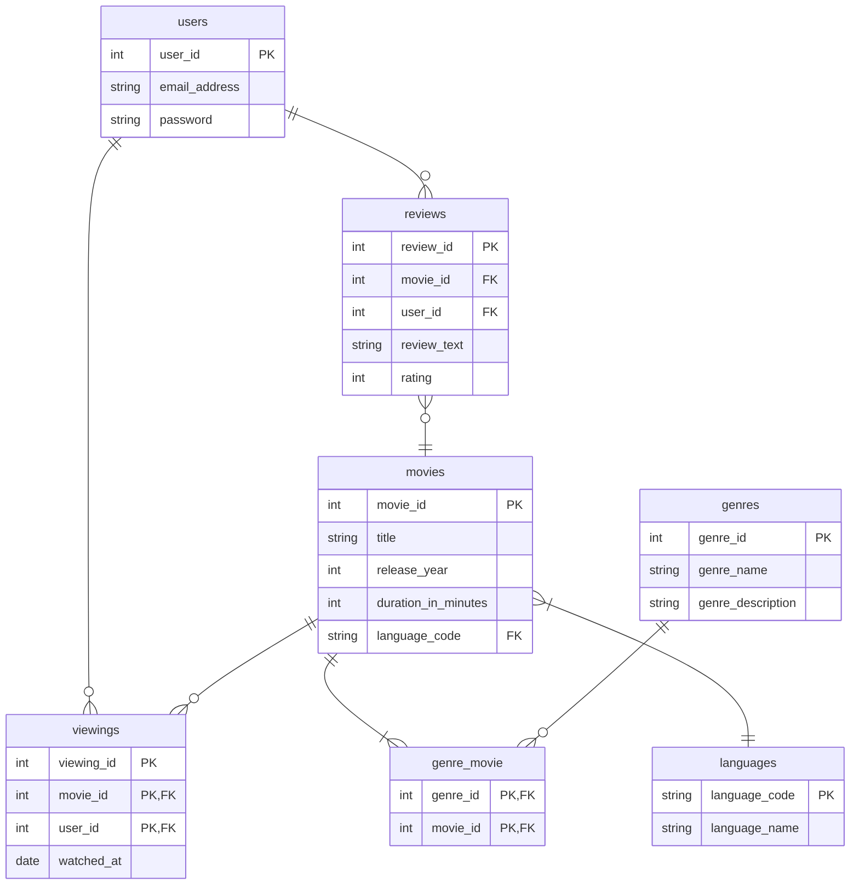
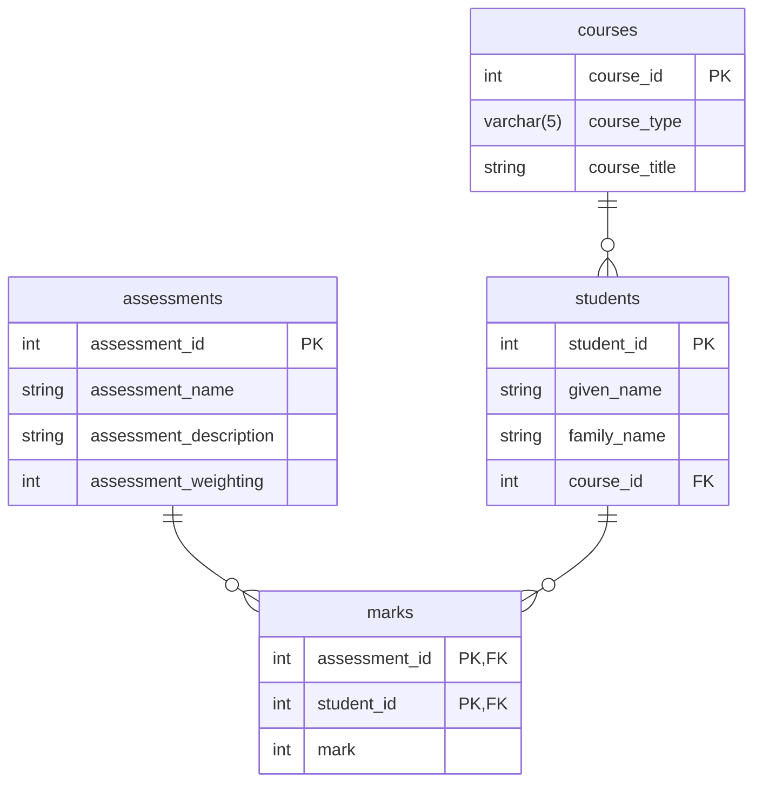

# Subqueries

A **subquery** is a query contained within another SQL query.

As always, looking at an example should make this idea easier to understand. 

We'll build on the course assessment example that we looked at in the first week of the course. 

Now that we know about relationships and the principles of database design, we can replace my simple, single table design with something that is more fit for purpose. 

#### Course Assessment: Logical ERD 


This database is designed for a tutor to help them assess a _single_ course e.g. the tutor teaching CFM7101 Calculus could use this database to store the details of the assessments for the course, the students taking their course, the degrees these students are studying, and the scores they achieve in the course assessments. 

Here are a some of the tables populated with example data to give a better feel for the structure of the database. 

<!--show the tables-->

## Scalar (Single Value) Subqueries

The simplest type of subquery to understand is one that retrieves a single (scalar) value. 

<!-- First, let's look at a simple query, and then we will look at how it can be used as a subquery.  -->

This query finds the weighting of the assessment with the highest weighting.

```sql
SELECT
    MAX(assessment_weighting)
FROM
    assessments;
```
There isn't anything new here, we have seen similar queries before. 

We can then use this query as a subquery (i.e. inside another query) to give the title of this assessment. 

```sql
SELECT
    assessment_title,
    assessment_weighting
FROM
    assessments
WHERE
    assessment_weighting = (
        SELECT
            MAX(assessment_weighting)
        FROM
            assessments
    );
```
- The subquery is placed inside parentheses (curved brackets).
- We call the query that contains the subquery the **outer query** or **main query**. 
- We call this type of subquery a scalar subquery because it returns a **single** value. 

Here's another example. 

Find the names of the students that scored higher than the average score for the 'Python Programming Concepts Quiz' (assessment 1).

<!-- ```sql
SELECT AVG(score) 
FROM student_assessment_scores 
WHERE student_assessment_scores.assessment_id=1;
```

This query can be used as a subquery to get the names of students that scored higher than the average score.  -->

```sql
SELECT
    s.given_name,
    s.family_name,
    sas.score
FROM
    students AS s
    INNER JOIN student_assessment_scores AS sas ON s.student_id = sas.student_id
WHERE
    sas.assessment_id = 1
    AND sas.score > (
        SELECT
            AVG(score)
        FROM
            student_assessment_scores
        WHERE
            student_assessment_scores.assessment_id = 1
    );
```
This example is a little more complex as it also uses a join to show the names of the students.

<!-- If you find this confusing, try and isolate the subquery and think what this will return i.e.

```sql
SELECT AVG(score) 
    FROM student_assessment_scores 
    WHERE student_assessment_scores.assessment_id=1; 
```
-->
## Multiple Rows, Single Value Subqueries

The previous subqueries each returned a single row with a single value. The following subqueries select single values, but multiple rows. 

Again we'll look at the subquery in isolation first. We can retrieve the IDs of certain degree types using `IN`.

```sql
SELECT
    degree_id
FROM
    degrees
WHERE
    degree_type IN ('BSc', 'MSc');
```

Using this query as a subquery allows us to get the names of students on the BSc and MSc degrees.

```sql
SELECT
    given_name,
    family_name
FROM
    students
WHERE
    degree_id IN (
        SELECT
            degree_id
        FROM
            degrees
        WHERE
            degree_type IN ('BSc', 'MSc')
    );
```

Here's another example that finds students that haven't completed assignment 1.

```sql
SELECT
    given_name,
    family_name
FROM
    students
WHERE
    student_id NOT IN (
        SELECT
            student_id
        FROM
            student_assessment_scores
        WHERE
            assessment_id = 1
    );
```

## Table Subqueries in the `FROM` Clause (Derived Tables)

<!-- Again, for the first example, we'll look at the subquery in isolation first.  -->
This query retrieves the scores of all the students that passed (i.e. they got a score of 40 or greater) assessment 2, the 'Programming Assignment'.

```sql
SELECT
    score
FROM
    student_assessment_scores
WHERE
    score >= 40
    AND student_assessment_scores.assessment_id = 2;
```

We can place this query in a `FROM` clause, and select columns to retrieve. 


```sql
SELECT
    MIN(passing_students.score) AS lowest_passing_score
FROM
    (
        SELECT
            score
        FROM
            student_assessment_scores
        WHERE
            score >= 40
            AND student_assessment_scores.assessment_id = 2
    ) AS passing_students;
```

This is a simple example, we didn't really need to use the subquery (you may be able to think of simpler ways of getting the same result), but it shows how a subquery can be used in a `FROM` clause.

Let's have a look at a slightly more useful example. This query finds the number of students studying the most popular degree.

```sql

SELECT
    MAX(student_counts.student_count) AS largest_degree_size
FROM
    (
        SELECT
            students.degree_id,
            COUNT(students.student_id) AS student_count
        FROM
            students
        GROUP BY
            students.degree_id
    ) AS student_counts;
```

SQL doesn't allow us to perform nested aggregations e.g. `MAX(COUNT(s.student_id))`. Therefore, we do the aggregation in two steps. The subquery counts the students on each degree. The outer query finds the highest value. 


This example selects each student name and their highest score from the two assessments.

<!-- 
```sql
SELECT student_id, MAX(score) AS max_score
    FROM student_assessment_scores
    GROUP BY student_id;
```
This works fine but doesn't retrieve the student names. To get the student names we can join this result to the students table.  
-->

```sql
SELECT
    s.given_name,
    s.family_name,
    best_scores.max_score
FROM
    students AS s
    INNER JOIN (
        -- The subquery gets the highest score for each student first
        SELECT
            student_id,
            MAX(score) AS max_score
        FROM
            student_assessment_scores
        GROUP BY
            student_id
    ) AS best_scores ON s.student_id = best_scores.student_id;
```

When we use a subquery in a `FROM` clause, the subquery acts like a virtual table that we can join to the outer query. 

## Correlated Subqueries
Unlike a regular subquery that runs once and independently, a correlated subquery executes repeatedly, once for each row evaluated by the outer query. 

Again, we'll break this down to make it easier to understand. The following query gets the number of students studying degree ID=1 (Data Science).

```sql
SELECT
    COUNT(*) AS student_count
FROM
    students
WHERE
    students.degree_id = 1;
```

We can make this a subquery and replace the hard-coded ID of 1 with _d.degree_id_ and the query will get linked to the outer query. 

```sql
SELECT
    degrees.degree_title,
    (
        SELECT
            COUNT(*) AS student_count
        FROM
            students
        WHERE
            students.degree_id = degrees.degree_id
    ) AS student_counts
FROM
    degrees;
```
- The subquery retrieves the count for a specific degree. 
- The key thing here is the subquery will be executed six times. Once for each degree in the database. Each time the subquery is run, a different _degree_id_ is passed in. 
<!-- 
```sql
SELECT MAX(score) 
        FROM student_assessment_scores 
        WHERE student_id = 1;
```

By making this a subquery and replacing the hard-coded ID of 1 with _s.student_id_ the query gets linked to the outer query. 

```sql
SELECT 
    s.given_name, 
    s.family_name,
    (
        SELECT MAX(sub_sas.score) 
        FROM student_assessment_scores AS sub_sas
        WHERE sub_sas.student_id = s.student_id
    ) AS personal_best_score
FROM students AS s;
```
- The outer query retrieves the best score for each student. 
- The key thing here is the subquery will be executed ten times. Once for each student. Each time the subquery is run, a different _student_id_ is passed in.  -->

Here's another correlated subquery. This query selects the names of all the students that scored higher than their degree average for assignment 1.

```sql
SELECT
    s.student_id,
    s.given_name,
    s.family_name,
    sas.score
FROM
    students AS s
    INNER JOIN student_assessment_scores AS sas ON s.student_id = sas.student_id
WHERE
    sas.assessment_id = 1
    AND sas.score > (
        SELECT
            AVG(sub_sas.score)
        FROM
            student_assessment_scores AS sub_sas
            INNER JOIN students AS sub_s ON sub_sas.student_id = sub_s.student_id
        WHERE
            sub_sas.assessment_id = 1
            AND sub_s.degree_id = s.degree_id -- Links the subquery to outer query's students table
    );
```

## Using HAVING

This query finds all the degrees where the average score for the degree is higher than the average student score for assignment 2

```sql
SELECT
    s.degree_id,
    AVG(sas.score) AS degree_average
FROM
    students AS s
    INNER JOIN student_assessment_scores AS sas ON s.student_id = sas.student_id
WHERE
    sas.assessment_id = 2
GROUP BY
    s.degree_id
HAVING
    AVG(sas.score) > (
        SELECT
            AVG(score)
        FROM
            student_assessment_scores AS sub_sas
        WHERE
            sub_sas.assessment_id = 2
    );
```

## Often We Can Avoid Subqueries

Often it is possible to re-write a query so it doesn't use a subquery

Let's take the first example we looked at, this finds the assessment with the highest weighting.

```sql
SELECT
    assessment_title,
    assessment_weighting
FROM
    assessments
WHERE
    assessment_weighting = (
        SELECT
            MAX(assessment_weighting)
        FROM
            assessments
    );
```

This query can easily be re-written using `ORDER BY` and `FETCH FIRST`

```sql
SELECT
    assessment_title,
    assessment_weighting
FROM
    assessments
ORDER BY
    assessment_weighting DESC
FETCH FIRST
    1 ROWS WITH TIES;
```

Most people would think the second version is clearer and easier to read when compared to using a subquery. 

<!-- > While the LIMIT 1 approach is shorter, we need to be careful! If two assessments tie for the exact same maximum weighting, LIMIT 1 will hide one of them. The subquery version is safer because it will return all tying rows. Alternatively we can use `FETCH FIRST 1 ROWS WITH TIES`. -->

Here's another example:-

Earlier we used a subquery to get the names of students on the BSc and MSc degrees.

```sql

SELECT
    given_name,
    family_name
FROM
    students
WHERE
    degree_id IN (
        SELECT
            degree_id
        FROM
            degrees
        WHERE
            degree_type IN ('BSc', 'MSc')
    );
```

This can be re-written using `INNER JOIN`.

```sql
SELECT
    s.given_name,
    s.family_name
FROM
    students AS s
    INNER JOIN degrees AS d ON s.degree_id = d.degree_id
WHERE
    d.degree_type IN ('BSc', 'MSc');
```

So when should we use subqueries and when should we use joins? Joins are generally preferred as we can show columns from multiple tables in the output. Subqueries cannot easily pass data up to the outer query. 

However, sometimes subqueries are preferred. For example, if we are simply using the subquery to filter results (like the previous query) this can be easier for humans to read. 

<!-- 
This is a good example, but I use it again for the CTE example.

Finally, let's have a look at subquery that would be better written as a `JOIN`. This query selects each student name and their highest score from the two assessments. -->

<!-- This query displays the highest score from both assessments for all students in the database e.g. Elizabeth Fong scored 85 for assessment ID=1 and 90 for assessment ID=2, Elizabeth's highest score was 90.  -->
<!-- 
```sql
SELECT
    s.given_name,
    s.family_name,
    best_scores.max_score
FROM
    students AS s
    INNER JOIN (
        SELECT
            student_id,
            MAX(score) AS max_score
        FROM
            student_assessment_scores
        GROUP BY
            student_id
    ) AS best_scores ON s.student_id = best_scores.student_id;
```

The query is simpler (without the nested GROUP BY) if we use an `INNER JOIN`.

```sql
SELECT
    s.given_name,
    s.family_name,
    MAX(score) AS best_score
FROM
    students AS s
    INNER JOIN student_assessment_scores AS sas ON s.student_id = sas.student_id
GROUP BY
    s.student_id,
    s.given_name,
    s.family_name;
``` -->


<!-- 
- Use Subqueries for readability when dealing with isolated calculations (averages, maximums).
- Use Subqueries (EXISTS) when you just need to check for a match without pulling data from the second table.
- Use Joins when you actually need to display columns from both tables in your final SELECT output. -->


<!-- 
## CTEs

## Dealing with Complexity
Breaking queries down into parts.  -->

<!-- 
## Limit

Scenario B: Joining data after using LIMITImagine you want to grab a list of the top 5 highest scores in the entire university, and then display the names of the students who achieved them. You cannot use LIMIT 5 on a standard join without cutting off your entire result set unpredictably.

```sql
SELECT s.given_name, s.family_name, top_five.score
FROM students AS s
INNER JOIN (
    -- Isolates exactly the top 5 score rows first
    SELECT student_id, score 
    FROM student_assessment_scores
    ORDER BY score DESC
    LIMIT 5
) AS top_five ON s.student_id = top_five.student_id;

``` -->




- AND in the JOIN becomes important for LEFT JOINs so introduce it here. 

Have a look at the following ERD written in mermaidjs.




- Run the subqueries first to see what they do.

For an introductory course, you should teach CTEs as a modern replacement for subqueries inside the FROM and JOIN clauses.
Keep Scalar Subqueries for the WHERE clause (like WHERE duration < (SELECT AVG...)), but tell your students that anytime they feel tempted to nest a large query inside a JOIN, they should build a CTE instead.

Would you like to see how to rewrite your highest-rated movie genre query into a clean CTE format for your lesson notes?

## Nearly all subqueries can be written as joins

Behind the scenes the database engine will often run a join instead.

Use a JOIN when you want to glue columns from two tables together to see them side-by-side on your screen.

Use an IN subquery when you only want columns from one table, but you need to filter it using a list from another table.

It may be worht doing IN vs JOIN for short-circuit vs exhaustive match.


## Student Assessment Example



## Left Join

The LEFT JOIN Use Case: Finding Inactive Records.

A LEFT JOIN keeps every single row from the left table, even if it cannot find a match in the right table. When a match is missing, the database pads the columns on the right with NULL.

The Business Scenario: The marketing team wants to find a list of all registered users who have never watched a single movie so they can send them a "Welcome back, here is a discount" email.

```
SELECT u.email_address, v.watched_at
FROM users u
LEFT JOIN viewings v ON u.user_id = v.user_id
WHERE v.viewing_id IS NULL;
```

## Right Join

The RIGHT JOIN Use Case: Checking Catalog Coverage

A RIGHT JOIN does the exact opposite: it keeps every single row from the right table, regardless of matches on the left.

The Business Scenario: The content curation team wants to find unpopular genres in the catalog. Specifically, they want a list of all genres that currently have zero movies assigned to them.

```
SELECT g.genre_name, gm.movie_id
FROM genre_movie gm
RIGHT JOIN genres g ON gm.genre_id = g.genre_id
WHERE gm.movie_id IS NULL;
```

This could also be written as a left join.

## Example subqueries

### Simple Scalar Subquery (Returns 1 Value)

Find all movies that have a duration longer than the average movie length.

```
SELECT title, duration_in_minutes
FROM movies
WHERE duration_in_minutes > (
    SELECT AVG(duration_in_minutes)
    FROM movies
);
```

### Simple List Subquery (Using IN)

Find the titles of all movies that have received a 5-star rating.

```
SELECT title
FROM movies
WHERE movie_id IN (
    SELECT movie_id
    FROM reviews
    WHERE rating = 5
);
```

This can alos be written as a join

```
SELECT DISTINCT m.title
FROM movies m
INNER JOIN reviews r ON m.movie_id = r.movie_id
WHERE r.rating = 5;
```

### The Exclusion Subquery (Using NOT IN)

Find the email addresses of all users who have never watched a single movie.

```
SELECT email_address
FROM users
WHERE user_id NOT IN (
    SELECT DISTINCT user_id
    FROM viewings
);
```

### Aggregate Subquery

Find all movies that were released in the same year as the longest movie in the database.

```
SELECT title, release_year
FROM movies
WHERE release_year = (
    SELECT release_year
    FROM movies
    ORDER BY duration_in_minutes DESC
    LIMIT 1
);
```

- Explain Analyse

## Slide 1: Introduction to Query Execution

Slide Bullets

- :The SQL Illusion: SQL tells the database what data you want, not how to get it.
  -The Query Optimizer: A built-in calculator that parses your code and creates an Execution Plan.
  -The Goal: Minimize "Disk I/O" (reading data from hard drives) and memory usage.
  -The Question: Does a subquery run slower than a join?

Students often think that writing a query differently changes how hard the computer has to work. In modern databases, that’s not always true. Today we are going to look behind the curtain at the Query Optimizer. This is the brain of the database that transforms your SQL syntax into raw operational steps. We'll see why the database engine sometimes treats subqueries and joins exactly the same, and when one completely outperforms the other.

## Slide 2: The Myth of the "Slower" Subquery

- The Old Rule: "Subqueries are slow because they run the inner loop over and over." (Outdated!)
- Subquery Flattening: Modern optimization engines automatically convert simple subqueries into JOIN structures internally.
- Example (The 5-Star Movie Filter):WHERE movie_id IN (SELECT movie_id FROM reviews...)Postgres automatically unrolls this into an internal hash join or semi-join.

If you read older database textbooks, they will tell you to avoid subqueries because they are slow. That is a myth in 2026. Modern database engines use a technique called 'subquery flattening' or 'pull-up'. When you write an IN subquery, the optimizer looks at it, realizes it's mathematically identical to a join, and rewrites it under the hood before running it. The execution speed for our 5-star movie query will be identical in both styles.

## Slide 3: Where Subqueries Lose (Correlated Subqueries)

- Non-Correlated Subquery: Runs exactly once, feeds the result to the outer query.
- Correlated Subquery: References columns from the outer query.
- The Execution Danger: The inner query must execute once for every single row processed by the outer query.Performance Scaling: Generates an \(O(N^2)\) "Nested Loop" complexity penalty.

Where subqueries absolutely can destroy your server's performance is when they are correlated. If the inner query relies on data from the outer query—like checking a user's specific viewing history row-by-row—the engine can no longer run the inner query just once. If your outer table has 10,000 movies, the inner query runs 10,000 times. If you can rewrite a correlated subquery into a standard INNER JOIN, you will see a massive speed increase.

## Slide 4: Where Joins Lose (The Duplication & Memory Trap)

- Join Bloat: Joins physically combine rows, creating massive temporary data structures in memory.
- The Aggregate Problem: Joining movies to reviews multiplies movie rows by the number of reviews they have.
  -Hidden Costs: Forcing the database to use DISTINCT or GROUP BY to clean up a join requires an expensive secondary memory-sorting operation.

Teacher's Talking Script:"Joins aren't always perfect either. When you join our movies table to a high-volume reviews table, the database physically creates a massive combined dataset in temporary memory. If a movie has 5,000 reviews, that movie's title is duplicated 5,000 times in RAM. If you only care if a movie has a review, an EXISTS subquery is much faster because it stops searching the moment it finds the first match, saving memory."

## Slide 5: The "NOT IN" vs. "LEFT JOIN" Danger Zone

- The Goal: Find users with zero viewings.
- The Trap: WHERE user_id NOT IN (SELECT user_id FROM viewings)
- The Flaw: If a single row in viewings contains a NULL value, a NOT IN query returns zero results globally due to Three-Valued Logic (AND NULL evaluates to unknown).
- The Fix: Use LEFT JOIN ... WHERE viewings.user_id IS NULL. It is faster and completely immune to the NULL trap.

Teacher's Talking Script:"Here is a critical warning for your practical lab assignments: never use NOT IN if the underlying column allows missing data. If your subquery list contains even a single NULL value, SQL's logic engine breaks and the entire query will return empty results. To find missing data cleanly and safely, a LEFT JOIN combined with an IS NULL check is the industry-standard execution pattern."

## Slide 6: Summary — How to Choose in Production

- Use Subqueries for readability when dealing with isolated calculations (averages, maximums).
- Use Subqueries (EXISTS) when you just need to check for a match without pulling data from the second table.
- Use Joins when you actually need to display columns from both tables in your final SELECT output.
- Always use EXPLAIN ANALYZE in your terminal to see the true cost!

Teacher's Talking Script:"To summarize: use subqueries when you want clean code for calculations, or when you want to filter a table based on an existential check. Use joins when you actually want to display information from both tables on the screen together. And when in doubt, run the EXPLAIN ANALYZE command in your terminal. This forces the database to show you exactly how many milliseconds each path took, ending any performance debate instantly."
