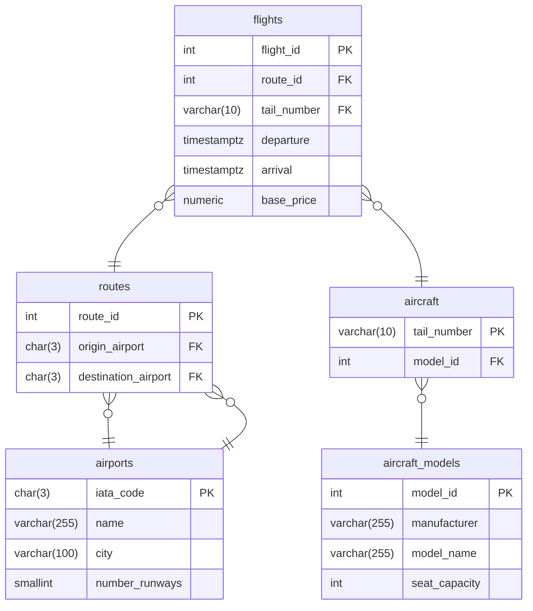
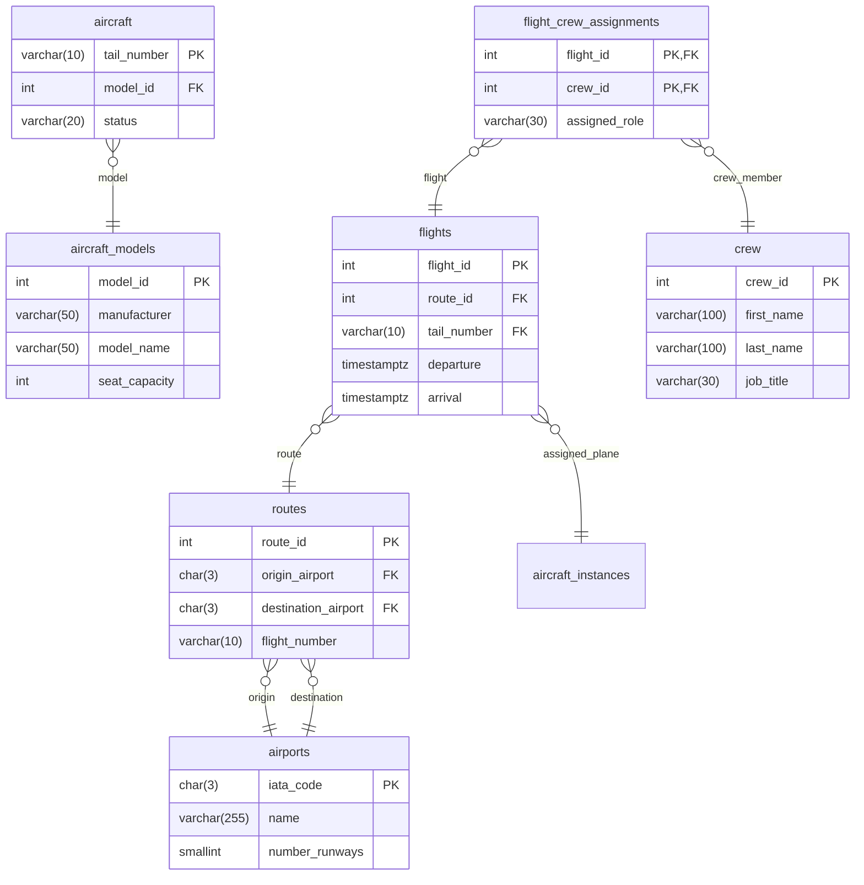

# Lab Subqueries

## Warming up

Make sure you use subqueries, many of these question can be answered using a join.

## Scalar Subqueries
Find all flights that cost more than the average flight price.

```sql
SELECT 
    flight_id, 
    route_id, 
    base_price
FROM flights
WHERE base_price > (SELECT AVG(base_price) FROM flights);

```

Find the details of the aircraft model that has the highest seating capacity.

```sql
SELECT 
    manufacturer, 
    model_name, 
    seat_capacity
FROM aircraft_models
WHERE seat_capacity = (SELECT MAX(seat_capacity) FROM aircraft_models);
```

## Multiple row, Single Value Queries

Find all aircraft models that have never actually been assigned to a physical aircraft in the fleet.

```sql
SELECT manufacturer, model_name
FROM aircraft_models
WHERE model_id NOT IN (
    SELECT DISTINCT model_id 
    FROM aircraft
);
```

Find any scheduled flights that are flying from London Heathrow Airport.


```sql
SELECT flight_id, route_id, departure
FROM flights
WHERE route_id IN (
    -- Multi-column, single-row subquery
    SELECT route_id
    FROM routes
    WHERE routes.origin_airport = 'LHR'
);
```
## dervied tables

Find the average number of flights per route

```sql
SELECT AVG(route_tallies.total_flights) AS average_flights_per_route
FROM (
    SELECT route_id, COUNT(flight_id) AS total_flights
    FROM flights
    GROUP BY route_id
) AS route_tallies;

```


## Correlated Subqueries

Find all flights that are cheaper than the average price for their specific route.

```sql
SELECT f1.flight_id, f1.route_id, f1.base_price
FROM flights f1
WHERE f1.base_price < (
    SELECT AVG(f2.base_price)
    FROM flights f2
    WHERE f2.route_id = f1.route_id -- The correlation link
);

```
Contrast this with the simpler, non-correlated example you looked at earlier. A non-correlated subquery compares every flight to the global average (e.g., £300). This correlated version compares a London-to-New York flight only against other London-to-New York flights, and a short domestic flight only against domestic prices.

List all aircraft models, and show the total number of physical aircraft the airline owns for each model.

```sql
SELECT 
    am.manufacturer,
    am.model_name,
    (
        SELECT COUNT(*)
        FROM aircraft a
        WHERE a.model_id = am.model_id -- The correlation link
    ) AS total_owned
FROM aircraft_models am;

```





