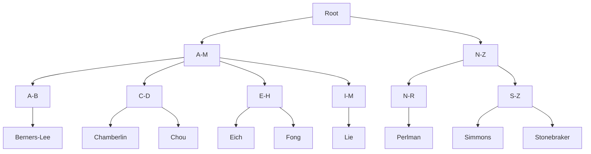

# Indexes
An **index** in a relational database is a separate data structure designed to speed up selecting rows from a table.

Let's look at an example to understand what this means. 

Here's the `students` table we have looked at previously. 

| student_id (PK) | given_name | family_name | degree_id (FK) | 
|-----------------|------------|-------------|----------------| 
| 1               | Elizabeth  | Fong        | 1              |  
| 2               | Donald     | Chamberlin  | 2              | 
| 3               | Michael    | Stonebraker | 2              | 
| 4               | Tracy      | Chou        | 3              | 
| 5               | Radia      | Perlman     | 3              | 
| 6               | Tim        | Berners-Lee | 4              | 
| 7               | Brendan    | Eich        | 4              | 
| 8               | Håkon Wium | Lie         | 6              | 
| 9               | Jen        | Simmons     | 3              | 

We run a query on this table.

```sql
SELECT *
FROM students
WHERE family_name = 'Simmons';
```
PostgreSQL will do a full **table scan**. It will look at each row in turn, if the `family_name` column is equal to 'Simmons' the row will be added to the result set. 

This will run very fast for the table above as there are only nine students. What if the table contains hundreds of thousands of students? A full table scan is going to take much longer. 

We can use an index to speed up finding rows that match our query. 

## B-trees
RDBMS often use a Balanced tree (B-tree) index to speed up queries. For example, if we created a B-tree index on the `family_name` column. The database would create the following structure:

#### Example B-Tree Index


At the leaf nodes i.e. where we store the family names, the RDBMS also stores pointers to full records. 

Now, instead of doing a full table scan, the RDBMS would do the following:
- **Root**. Is 'Simmons' between A and M? No.
- **Root**. Is 'Simmons' between N and Z? Yes, move on to N-Z.
- **N-Z**. Is 'Simmons' between N and R? No.
- **N-Z**. Is 'Simmons' between S and Z? Yes, move on to S-Z
- **S-Z**. Does 'Simmons' match? Yes, add to result set.
- **S-Z**. Does 'Stonebraker' match? No.

We can find the correct results in fewer steps, speeding up our query. 

RDBMS are very effective at creating B-trees. They will create balanced splits and if needed split using the second or third letter.

If we had a million rows, we may have more splits and more leaf nodes, but the query would still run significantly faster than doing a full table scan. 


A B-Tree

An index is a pre-sorted list of rows in a table.

show students table, lets say we have 100,000 records

show index on family name

what does the index look like?

See SQL book for a better example

                     [ Root Node ]
                        /     \
                 [ A - M ]   [ N - Z ]
                  /     \       /     \
         [Branch] ...   ...  [N-S]   [T-Z]    <-- Branch Nodes
                              / \
    [Leaf]                 ...  [ 'Smith' -> Pointers: [B12, R4], ... [B40, R1]]

If we run a query such as

SELECT \* FROM students WHERE family_name="Codd"

Without the index we do a full table scan that is we go though each record one by one all the way to the end of the table.

If we have an index we can search for Codd and it will tell us the row numbers.

How does it go straight to the 'Codd'?

This is like saying find all the places where Edgar Codd is mentioned in the History of Databases book. We have to read every single word and then record the page number for the occurences of Codd.

If we have the index which is sorted alphabetically we can go straight to Codd and find the page numbers.

Disadvantage of indexes

- Extra disk space for the index
- Updates, deletes and inserts require us to re-arrange the index.

How do composite indexes work?
 
When to always create indexes

- PK columns are automaitcally indexed
- We should alos index FK columns, makes joins much faster. prevents full table scans during a join

When to consider indexes

- When a column is reguarly the subject of a WHERE clause
- When a column is reguarly used in ORDER BY or GROUP BY
- When there is high cardinality i.e. lots of different values e.g. email addresses. Low cardinality e.g. pass_fail_status not a good idea

When to avoid indexes

- Small tables - all the examples in this module
- Frequently updated/inserted tables
- Tables with lots of NULL values

What do we mean by small?? ~ 10,000 roiws

## How to create indexes

-- 1. Create the table structure

```
CREATE TABLE students (
    student_id INT PRIMARY KEY,
    given_name VARCHAR(50),
    family_name VARCHAR(50),
    course_id INT
);

-- 2. Create the custom indexes right after
CREATE INDEX idx_students_course_id ON students(course_id);
CREATE INDEX idx_students_family_name ON students(family_name);
```

- Day one create indexes on PKs and FKs
- Wait, weeks/months later and we can see how users are using the database we can see which columns we need to index.

## functions and wildcards break indexes

INDEX DESTROYED (Full Table Scan)
SELECT _ FROM students WHERE family_name LIKE '%smith';
SELECT _ FROM students WHERE LOWER(family_name) = 'smith';
